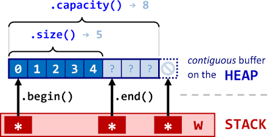

# 1

### Keywords

Standard Template Library，Decoupling，Containers，Algorithms，Iterators

| **容器名称 (C++)**             | **对应 Java 集合** | **物理内存结构**               | **特点与最合适场景**                             |
| ------------------------------ | ------------------ | ------------------------------ | ------------------------------------------------ |
| **`std::vector<T>`**           | `ArrayList<T>`     | 连续的物理内存（一字排开）     | 尾部插入极快，支持下标随机访问，但中间插入极慢。 |
| **`std::list<T>`**             | `LinkedList<T>`    | 散落的物理节点，靠双向指针连接 | 任意位置插入删除极快，但不支持下标随机访问。     |
| **`std::unordered_map<K, V>`** | `HashMap<K, V>`    | 哈希表（数组 + 链表/红黑树）   | 通过 Key 查找 Value 极快，接近 $O(1)$ 时间。     |

### Hints

`std::vector` 是 C++ 中使用高频度第一的容器。它的本质就是**在堆区（Heap）开辟的一块连续的物理内存空间**，相当于一个可以自动扩容的动态数组。



在 C++ 的物理世界里，一个 `std::vector` 对象在栈（Stack）上其实非常小，它内部只有 **3 个指针**（在 64 位系统下，总共只占 **24 字节**）：

1. **`_Myfirst`（指向堆区连续空间的起点，即 `begin()`）**
2. **`_Mylast`（指向最后一个有效数据后面的位置，即 `end()`）**
3. **`_Myend`（指向整块在堆区申请的连续物理空间的终点）**

通过这三个物理指针，引申出了两个极其重要的概念，千万不能混淆：

- **`size()` (大小)**：当前容器里**实际装了多少个元素**（即 `_Mylast - _Myfirst`）。
- **`capacity()` (容量)**：当前这块连续堆内存**最多能装多少个元素**（即 `_Myend - _Myfirst`）。

既然我们知道 `vector` 频繁自动扩容会导致：

1. 堆区频繁申请和释放，**拖慢运行速度**（性能损耗）。
2. 导致所有指向内部元素的指针、引用、迭代器**瞬间失效（变成悬空指针）**。

那么在 C++ 中，有什么高级技巧可以完美规避这个问题？

答案是：**`reserve(预估容量)` (预留空间)**。

```cpp
std::vector<int> v;
v.reserve(1000); // 💡 物理动作：提前让堆管理器一次性切出 1000 个 int 的连续大空间！

// 此时 capacity 直接就是 1000。
// 随后你进行 1000 次 push_back，它会在这个温暖的安全屋里直接写入，
// 绝对不会发生一次“搬家/扩容”动作，首地址稳如泰山，指针永不失效！
```


如果说**容器**是 C++ STL 的**骨骼与肌肉**，那么**算法**就是它的**神经与灵魂**。在 C++ 领域，有一句非常有名的格言：“**能用 STL 算法，就绝对不要手写 `for` 循环。**”因为标准库的算法在编译期会进行极致的底层优化（如循环展开、SIMD 矢量化指令等），比我们手写的循环要快得多。

既然你想多学、多积累，那我们今天就来一次 **STL 常用算法与未涉足容器的“大阅兵”**。

 **🏛️ 第一部分：STL 的“全能算法武器库”**

标准库算法全部存放在 `<algorithm>` 头文件中。它们全部采用迭代器（Iterator）作为参数。我们把最常用、含金量最高的算法分为四大类：

 1. 查找与计数类（非修改式算法）

- **`std::find`**：在指定范围内查找等于某个值的元素。

  

  ```cpp
  std::vector<int> v = {10, 20, 30, 40};
  // 查找 30。如果找到，返回指向它的迭代器；没找到则返回 v.end()
  auto it = std::find(v.begin(), v.end(), 30);
  ```

- **`std::find_if`**：**（极高频）** 传入一个条件（通常是 Lambda 表达式/匿名函数），查找第一个满足条件的对象。

  ```cpp
  // 查找第一个大于 25 的数
  auto it = std::find_if(v.begin(), v.end(), [](int x) {
      return x > 25; 
  }); // 找到了 30
  ```
  
- **`std::count_if`**：统计满足条件的元素个数。

  ```cpp
  // 统计偶数的个数
  int num = std::count_if(v.begin(), v.end(), [](int x) { return x % 2 == 0; });
  ```

 2. 排序与重排类

- **`std::sort`**：标准排序。底层是**内省排序（Introsort）**——它会根据数据量动态在 **快速排序、堆排序和插入排序** 之间切换，性能极高。

  ```cpp
  std::vector<int> v = {40, 10, 30, 20};
  std::sort(v.begin(), v.end()); // 默认升序：10, 20, 30, 40
  
  // 降序排序：传入自定义比较逻辑
  std::sort(v.begin(), v.end(), [](int a, int b) { return a > b; }); // 40, 30, 20, 10
  ```
  
- **`std::reverse`**：反转容器内元素的物理顺序。

  

  ```cpp
  std::reverse(v.begin(), v.end()); // 逆序颠倒
  ```

 3. 修改与填充类

- **`std::fill`**：用同一个值填满容器。

  

  ```cpp
  std::vector<int> v(5); // 5 个元素
  std::fill(v.begin(), v.end(), -1); // 全部变成 -1
  ```

- **`std::for_each`**：对范围内的每个元素执行一次指定的函数（通常用于对每个对象进行统一修改或打印）。

  

  ```cpp
  std::for_each(v.begin(), v.end(), [](int& x) { x *= 2; }); // 每个元素乘以 2
  ```

 🏛️ 第二部分：STL 容器家族的“其他隐世高手”

除了我们前面介绍的三大件（`vector`, `list`, `unordered_map`），STL 还有一些在特定物理场景下不可替代的容器：

1. 关联容器：`std::map<K, V>` 与 `std::set<T>`（有序帝国）

在 C++ 中，带 `unordered_` 前缀的（如 `unordered_map`）底层是哈希表，数据是无序的。而**不带** `unordered_` 的，底层是极其强悍的 **红黑树（Red-Black Tree，一种自平衡二叉搜索树）**。

- **`std::map<K, V>`**：
  - **特点**：放入里面的键值对，会**自动按照 Key 的大小进行升序排序**！
  - **物理性能**：插入、删除、查找的性能都是稳定的 $O(\log n)$。
  - **大作业场景**：如果你需要按学号“从小到大”依次打印学生，用 `std::map` 会自动帮你排好序。
- **`std::set<T>`（集合）**：
  - **特点**：里面**只存 Key**，没有 Value。且里面的元素**自动去重**，并且**自动升序排序**。
  - **大作业场景**：记录所有已分配的算力卡编号。由于编号不能重复，用 `set` 只要往里塞，重复的会自动被过滤掉。

2. 容器适配器（Container Adapters）

它们并不是全新的数据结构，而是把现有的容器（如 `vector` 或 `list`）穿上一件特制的“马甲”，阉割掉一部分功能，从而呈现出特定逻辑的数据结构：

```
                    ┌────────────────────────┐
                    │      底层容器 (deque/list)│
                    └───────────┬────────────┘
                                │ (套上逻辑马甲)
                                ▼
                    ┌────────────────────────┐
                    │ 容器适配器 (std::stack) │
                    └────────────────────────┘
```

- **`std::stack<T>`（栈）**：
  - **逻辑**：**后进先出（LIFO）**。
  - **语法**：只有 `push()`（入栈）、`pop()`（出栈）、`top()`（看栈顶）三个核心操作。不支持随机访问。
- **`std::queue<T>`（队列）**：
  - **逻辑**：**先进先出（FIFO）**。
  - **语法**：`push()`（队尾入队）、`pop()`（队头出队）、`front()`（看队头）。
  - **大作业场景**：学生排队申请 GPU 算力资源，先来先分配。


### Example Programs

1.vector capacity

```cpp
#include <iostream>
#include <vector>

int main() {
    std::cout << "--- 测试 vector 扩容的地址突变 ---" << std::endl;

    std::vector<int> v;

    // 观察随着元素插入，size、capacity 以及首元素物理地址的变化
    for (int i = 0; i < 10; ++i) {
        v.push_back(i);
        
        // 打印当前的 size, capacity 以及第一个元素的内存地址
        std::cout << "放入元素 " << i 
                  << " | size = " << v.size() 
                  << " | capacity = " << v.capacity();
        
        if (!v.empty()) {
            std::cout << " | 首元素物理地址 = " << &v[0] << std::endl;
        } else {
            std::cout << std::endl;
        }
    }

    return 0;
}
```

2.vector

```cpp
#include <iostream>
#include <vector> // 💡 必须引入头文件

int main() {
    // === 1. 初始化 ===
    std::vector<int> v; // 创建一个装 int 的空动态数组

    // === 2. 尾部插入 (Java: list.add(x)) ===
    v.push_back(10);
    v.push_back(20);
    v.push_back(30);

    // === 3. 访问元素 ===
    std::cout << "第一个元素: " << v[0] << std::endl; // 支持像数组一样用 [] 访问
    std::cout << "越界安全访问: " << v.at(1) << std::endl; // at() 会检查越界，越界时会抛出异常

    // === 4. 遍历元素 ===
    // 方式 A：现代 C++ 范围 for 循环（最常用，类似 Java 的 for-each）
    // 用 const int& 是为了防止拷贝，提高性能
    for (const int& val : v) {
        std::cout << val << " ";
    }
    std::cout << std::endl;

    // 方式 B：使用【迭代器（Iterator）】遍历（底层核心）
    // v.begin() 指向首元素，v.end() 指向尾元素后面那个哨兵位置
    // it 伪装成指针，用 *it 拿到里面的值
    for (std::vector<int>::iterator it = v.begin(); it != v.end(); ++it) {
        std::cout << *it << " ";
    }
    std::cout << std::endl;

    // === 5. 删除元素 ===
    v.pop_back(); // 弹出尾部最后一个元素 (此时剩下 10, 20)

    return 0;
}
```

3.list

```cpp
#include <iostream>
#include <list> // 💡 引入头文件

int main() {
    std::list<int> l;

    // === 1. 插入（两端都可以极速插入） ===
    l.push_back(20);  // 尾部插入
    l.push_front(10); // 头部插入：[10, 20]

    // === 2. 链表不支持 [index] 随机访问！ ===
    // ❌ std::cout << l[0]; // 编译报错！因为链表无法通过数学计算直接定位地址

    // === 3. 遍历（只能通过迭代器一步步走过去） ===
    for (const int& val : l) {
        std::cout << val << " ";
    }
    std::cout << std::endl;

    return 0;
}
```

4.unordered_map

```cpp
#include <iostream>
#include <string>
#include <unordered_map> // 💡 引入头文件

int main() {
    // 声明一个 Key 是 string，Value 是 int 的哈希表
    std::unordered_map<std::string, int> scores;

    // === 1. 插入/更新键值对 ===
    scores["Zhou"] = 100;
    scores["Wu"] = 98;

    // === 2. 查找元素 (极其高频，注意避坑) ===
    std::string target = "Zhou";
    
    // 💡 避坑写法：不要直接用 scores[target] 来判断是否存在！
    // 因为如果 key 不存在，[] 运算符会默默在表里新建一个默认值的键值对！
    // 正确写法：使用 find()
    auto it = scores.find(target); 
    if (it != scores.end()) {
        // it->first 是 Key，it->second 是 Value
        std::cout << "找到了！" << it->first << " 的分数是: " << it->second << std::endl;
    } else {
        std::cout << "未找到该用户！" << std::endl;
    }

    // === 3. 遍历哈希表 ===
    // 用 const auto& 让编译器自动推导键值对类型，非常清爽
    for (const auto& pair : scores) {
        std::cout << "Key: " << pair.first << ", Value: " << pair.second << std::endl;
    }

    return 0;
}
```

50.\<algorithm>

```cpp
#include <iostream>
#include <vector>
#include <set>
#include <algorithm> // 💡 引入算法头文件

int main() {
    std::cout << "--- 1. 测试 std::set 的去重与自动排序 ---" << std::endl;
    std::set<int> mySet;
    mySet.insert(40);
    mySet.insert(10);
    mySet.insert(40); // 💡 重复插入 40
    mySet.insert(20);

    std::cout << "set 中的元素（应自动去重并升序）: ";
    for (int x : mySet) {
        std::cout << x << " "; // 输出应为: 10 20 40
    }
    std::cout << "\n" << std::endl;


    std::cout << "--- 2. 测试 std::find_if 与 Lambda 表达式 ---" << std::endl;
    std::vector<int> scores = {85, 92, 59, 74, 99, 61};

    // 💡 寻找第一个不及格（小于 60）的分数
    auto it = std::find_if(scores.begin(), scores.end(), [](int score) {
        return score < 60;
    });

    if (it != scores.end()) {
        std::cout << "找到了第一个不及格的分数: " << *it << std::endl;
    }


    std::cout << "\n--- 3. 测试 std::sort 降序排列 ---" << std::endl;
    // 💡 用 Lambda 表达式指定降序规则：前面的数 a 大于后面的数 b
    std::sort(scores.begin(), scores.end(), [](int a, int b) {
        return a > b;
    });

    std::cout << "降序排序后的成绩单: ";
    for (int score : scores) {
        std::cout << score << " ";
    }
    std::cout << std::endl;

    return 0;
}
```


