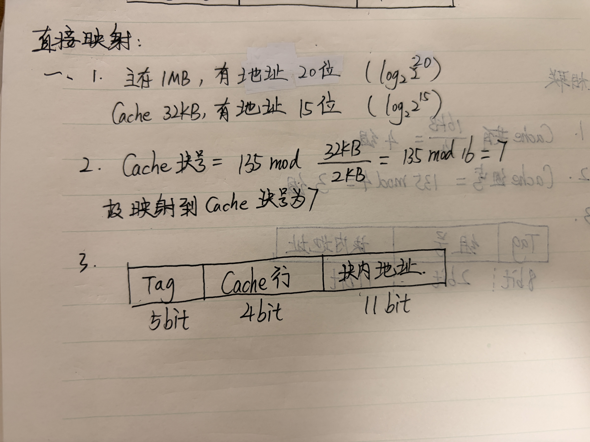
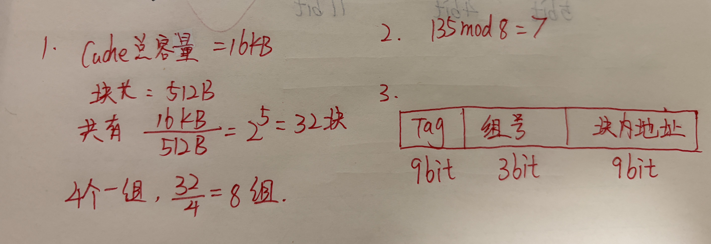
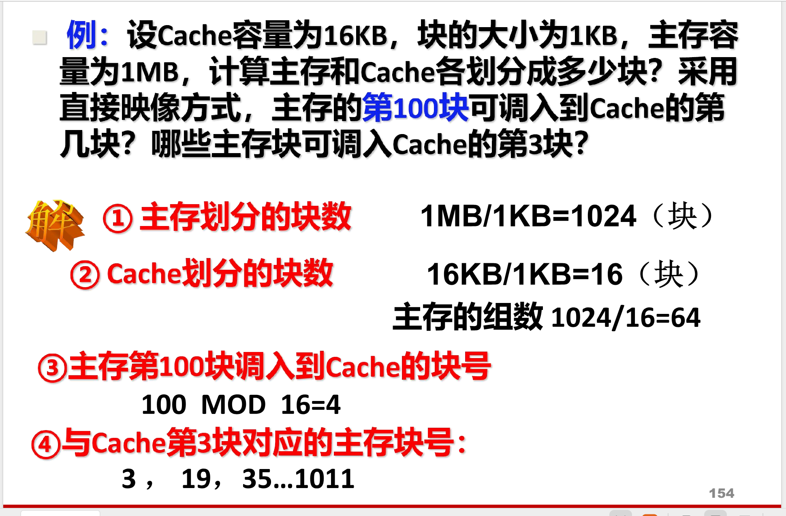

**是的，完全正确。** 无论是**直接映射**、**全相联映射**，还是**组相联映射**，它们虽然对内部功能区间的拆分方法不同，但**各字段位数加起来，必然严格等于主存储器地址的总字长**。

因为这三种映射方式，本质上只是**同一根主存总线在硬件逻辑上的不同解码看法的游戏**。CPU 访问内存时给出的总线位数是死的，硬件怎么拆，总数都不会变。

为了让你在考试里能闭着眼睛画对这三个图，我们把这三种映射的地址拆分逻辑和等式关系做个完整梳理：

## 1. 直接映射（Direct Mapping）

- **拆分逻辑**：主存的一块只能固定挪到 Cache 的某一个特定块（一对多）。

- **地址结构图**：

  $$\begin{array}{|c|c|c|} \hline \text{主存字块标记 (Tag)} & \text{Cache字块地址 (Index)} & \text{块内地址 (Offset)} \\ \hline \end{array}$$

- **等式关系**：

  $$\text{主存地址字长} = \text{Tag 位数} + \text{Cache 块号位数} + \text{块内地址位数}$$

- **对应你上一题的数字**：$19 = 5 + 4 + 10$

## 2. 全相联映射（Fully Associative Mapping）

- **拆分逻辑**：主存的任意一块都可以挪到 Cache 的任意一个空位置（多对多）。因为可以乱坐，Cache 内部就没有固定的“行号”分配给它了，所以地址结构里**不再需要 Cache 字块地址**，只剩下“你是谁（哪个主存块）”和“在块内哪个位置”。

- **地址结构图**：

  $$\begin{array}{|c|c|} \hline \text{主存字块标记 (Tag)} & \text{块内地址 (Offset)} \\ \hline \end{array}$$

- **等式关系**：

  $$\text{主存地址字长} = \text{Tag 位数} + \text{块内地址位数}$$

- **对应你上一题的数字**（如果改成全相联）：

  - 块内地址依然是 $10$ 位。
  - Tag 独占剩下的所有高位：$19 - 10 = 9$ 位（这 $9$ 位其实就是整个主存的字块号，因为 $512\text{KB}/1\text{KB} = 512 = 2^9$ 块）。
  - 验证等式：$19 = 9 + 10$。

## 3. 组相联映射（Set-Associative Mapping）

- **拆分逻辑**：前两种方式的折中。把 Cache 先分成“组”，主存块固定映射到某个“组”里，但进了组之后可以随便挑组内的空位坐（例如路组相联）。

- **地址结构图**：

  $$\begin{array}{|c|c|c|} \hline \text{主存字块标记 (Tag)} & \text{组地址 (Set Index)} & \text{块内地址 (Offset)} \\ \hline \end{array}$$

- **等式关系**：

  $$\text{主存地址字长} = \text{Tag 位数} + \text{Cache 组号位数} + \text{块内地址位数}$$

- **对应你上一题的数字**（假设题目改成 **2路组相联**）：

  - 块内地址依然是 $10$ 位。
  - Cache 总共 $16$ 块，每组 $2$ 块，所以总组数 $= 16 / 2 = 8$ 组。$8 = 2^3$，组地址需要 **$3$ 位**。
  - Tag 位数 $= 19 - 3 - 10 = \mathbf{6}$ 位。
  - 验证等式：$19 = 6 + 3 + 10$。

## 💡 考前通用纠错心法

你在大题里画完这三个图之后，**绝对要做的第一件事**就是把你自己算出来的几个字段的位数强行相加（比如 $5+4+10$ ），看看它等不等于你在第（2）问算出来的**主存总地址位数**。

- 如果相等，心里就有底了，大方向绝不会错。
- 如果加起来多了一位或者少了一位，说明你在算“总块数”或者“组数”的时候，2的幂次方数错了，赶紧回过头去找原因。

> [!IMPORTANT]
>
> 块内地址，就是单块cache的寻址范围
>
> tag也相当于整个主存储器的字块号

## EG

太棒了，这种主动分类防守、把考点一网打尽的思路最适合应对期末考试。

为了让你一次性把 **直接映射**、**全相联映射** 和 **组相联映射** 的地址结构图和块号计算全部练透，我为你设计了以下三道互不重复、各有侧重的模拟题。

你可以像刚才一样，在草稿纸上算完、画完拍给我看，我会严格作为阅卷老师来帮你审视。

### 📝 第一题：直接映射（巩固基础与边界）

**题目条件**：假设主存容量为 $1\text{ MB}$，Cache 容量为 $32\text{ KB}$，块长为 $2\text{ KB}$。

1. 主存地址和 Cache 地址各有多少位？
2. 在直接映射方式下，主存块号为 **$135$** 的数据块，映射到 Cache 中的块号是多少？
3. 画出直接映射方式下的主存地址字段图，并标明各段的位数。

### 📝 第二题：全相联映射（理解极简结构）

**题目条件**：假设主存容量为 $512\text{ KB}$，Cache 容量为 $64\text{ KB}$，块长为 $4\text{ KB}$。

1. 在全相联映射方式下，主存块号为 **$135$** 的数据块，可以映射到 Cache 的哪些块中？
2. 画出全相联映射方式下的主存地址字段图，并标明各段的位数。

### 📝 第三题：组相联映射（迎战期末压轴）

**题目条件**：假设主存容量为 $2\text{ MB}$，Cache 容量为 $16\text{ KB}$，块长为 $512\text{ B}$。系统采用 **$4$ 路组相联映射**（即每组包含 4 个 Cache 块）。

1. Cache 总共有多少个“组”？
2. 主存块号为 **$135$** 的数据块映射到 Cache 时，其对应的 **组号** 是多少？
3. 画出该组相联映射方式下的主存地址字段图，并标明各段的位数。

> 💡 **考前温馨提示**：
>
> 注意第三题的块长单位是 **$\text{B}$（字节）**，而不是 $\text{KB}$。计算时一定要保持单位统一（统一化为 2 的幂次方）。

准备好就可以动笔了，期待你再次拿下全对满分！

