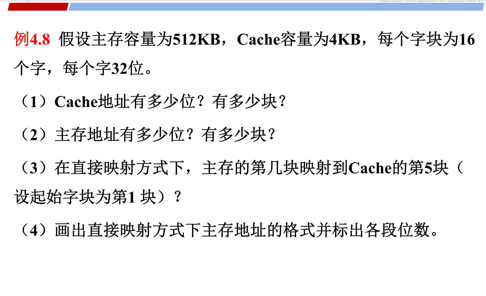
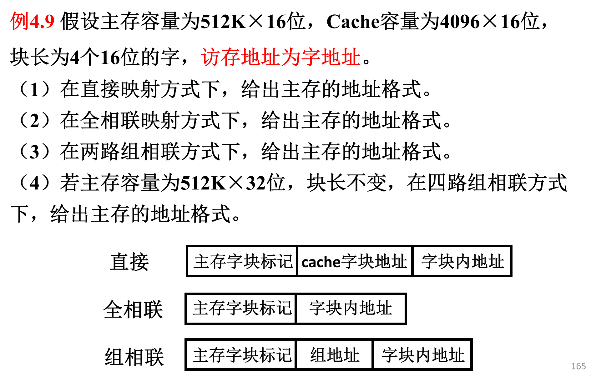
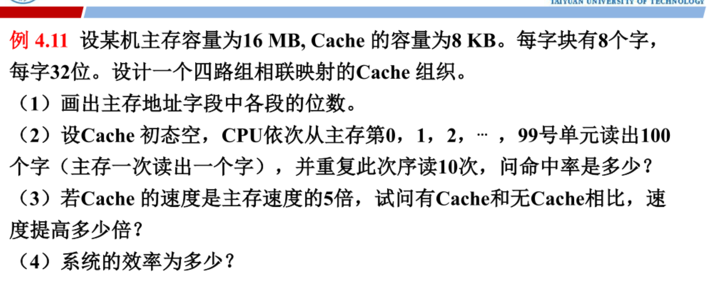

## 🛠️ 基础物理参数清洗：辨析“按字”还是“按字节”

看题干描述：

> “主存容量为 **16 MB**，Cache容量为 **8 KB**” （单位带 **B**，说明主存和 Cache 容量在硬件上是以**字节**为总量给出的）。
>
> “CPU依次从主存第 0, 1, ..., 99 **号单元**读出100个**字**（主存一次读出一个字）”。

这里有个最核心的学术判断：**既然读出的 100 个元素是“字”，且块长也是用“8个字”定义的，说明 CPU 访存是以“字地址”进行寻址的。** 为了让切蛋糕时最右边的“块内地址”完美闭环，我们采用“统一到字节尺码，但在最后细分字”的经典解法。

- **字长** = $32\text{位} = 4\text{B}$
- **每个字块大小（块长）** = $8 \text{ 个字} = 8 \times 4\text{B} = 32\text{B} = 2^5\text{B}$
- **主存总容量** = $16\text{MB} = 2^{24}\text{B} \rightarrow$ **主存地址总位数 = 24 位**。
- **Cache 总容量** = $8\text{KB} = 8 \times 1024\text{B} = 2^{13}\text{B}$

## 📝 逐问精准拆解

### （1）画出主存地址字段中各段的位数。

我们设计的是一个**四路组相联映射**的 Cache 组织。地址分为：`Tag` + `组地址 (Set Index)` + `块内地址`。我们从右往左切：

1. **块内地址（Offset）**：

   一个块总共有 $32\text{B} = 2^5\text{B}$。在字节编址的视角下，块内寻址需要 **5 位**。

   *(注：如果细分，由于每个字占 4 字节（2位），这 5 位在硬件上常被拆为：3位字地址 + 2位字节地址。总长依然是 5 位)*。

2. **组地址（Set Index）**：

   - 先求 Cache 总块数：

     $$C = \frac{\text{Cache总容量}}{\text{块长}} = \frac{8\text{KB}}{32\text{B}} = 256 \text{ 块} = 2^8 \text{ 块}$$

   - 再求 Cache 总组数（四路组相联，每组 4 块）：

     $$G = \frac{\text{总块数 } C}{4} = \frac{256}{4} = 64 \text{ 组} = 2^6 \text{ 组}$$

   - 唯一标识 64 个组，组地址需要 **6 位**。

3. **主存字块标记（Tag）**：

   利用总长守恒定律：

   $$\text{Tag 位数} = 24 - 6\text{ (组地址)} - 5\text{ (块内地址)} = \mathbf{13} \text{ 位}$$

**主存地址格式图：**

| **主存字块标记 (Tag)** | **组地址 (Set Index)** | **块内地址 (Offset)** |
| ---------------------- | ---------------------- | --------------------- |
| **13 位**              | **6 位**               | **5 位**              |

*(总计：13 + 6 + 5 = 24 位)*

### （2）问命中率是多少？

这是考查**空间局部性**与**时间局部性**的经典过程推导。

- **基本规律**：因为一个块有 **8 个字**。当 CPU 访问第 0 号字单元时，Cache 发生缺失，硬件会把包含第 0~7 号字在内的这**整个块**全部从主存调入 Cache。
- **第一次循环（读 100 个字）**：
  - 读第 0 个字 $\rightarrow$ 缺失（把 0~7 号字一起充能进 Cache）。
  - 读第 1~7 个字 $\rightarrow$ 连续 **7 次全部命中**。
  - 读第 8 个字 $\rightarrow$ 缺失（把 8~15 号字一起充能进 Cache）。
  - 读第 9~15 个字 $\rightarrow$ 连续 **7 次全部命中**。
  - 以此类推，每 8 个字里就会有 1 次缺失，7 次命中。
  - 直到读完 100 个字。总共需要的块数 = $\lceil 100 / 8 \rceil = 13$ 个块。
  - 这 100 个字里，**缺失次数 = 13 次**。剩下的 $100 - 13 = 87$ 次全命中。
- **后续 9 次重复循环**：
  - 由于这 100 个字（共占用 13 个 Cache 块）已经全部躺在 Cache 里了，且四路组相联容量很大（256块），后面重复读的 9 次里，**每一次都是 100% 全部命中**！
- **总体统计**：
  - 总访问次数 = $100 \times 10 = 1000 \text{ 次}$
  - 总缺失次数 = 仅在第一次循环时缺失了 **13 次**
  - 总命中次数 = $1000 - 13 = 987 \text{ 次}$

$$\text{命中率 } H = \frac{987}{1000} = \mathbf{98.7\%}$$

### （3）有 Cache 和无 Cache 相比，速度提高多少倍？

设主存的访问周期为 $M$，因为 Cache 速度是主存的 5 倍，所以 Cache 的访问周期 $C = \frac{1}{5}M = 0.2M$。

- **没有 Cache 的总时间**：$T_{无} = 1000 \times M$

- **引入 Cache 后的平均访问周期**：

  $$t_a = H \times C + (1 - H) \times M = 98.7\% \times 0.2M + (1 - 98.7\%) \times M$$

  $$t_a = 0.1974M + 0.013M = 0.2104M$$

- **速度提高倍数（加速比公式）**：

  $$\text{提高倍数} = \frac{T_{无}}{T_{有}} - 1 = \frac{M}{t_a} - 1 = \frac{M}{0.2104M} - 1 \approx 4.75 - 1 = \mathbf{3.75} \text{ 倍}$$

*(注：学术上“提高多少倍”一般指 $Sp - 1$，如果有些老师批卷不严格，直接写加速比 4.75 倍也算对，考试时建议写成“提高了 3.75 倍，即速度是原来的 4.75 倍”最保险)*。

### （4）系统的效率是多少？

系统效率是指 Cache 的理想最快速度与引入 Cache 后实际平均速度的比值：

$$\text{系统效率 } e = \frac{\text{Cache访问周期 } C}{\text{平均访问周期 } t_a} = \frac{0.2M}{0.2104M} \approx \mathbf{95.06\%}$$

这道题的四问核对下来，特别是第二问通过“每8个字缺失1次”推导出总共缺失 13 次的局部性分析，你完全理顺了吗？收到你的反馈信号后我们再继续！