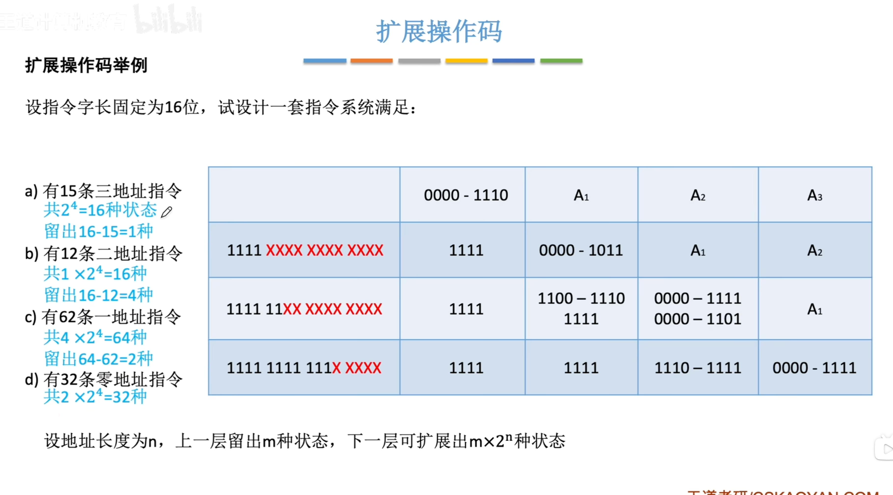
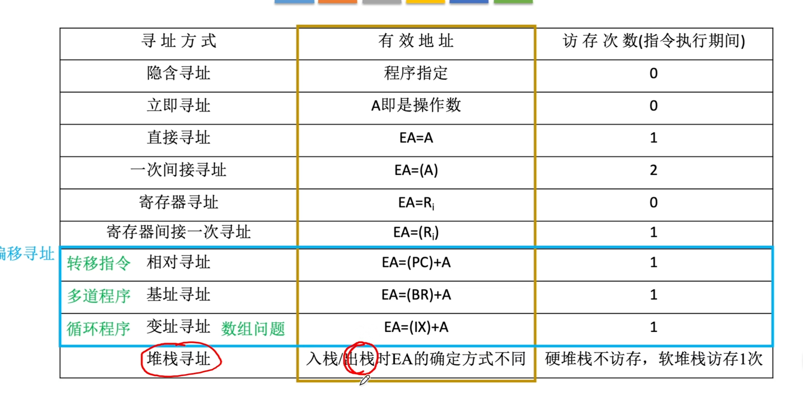
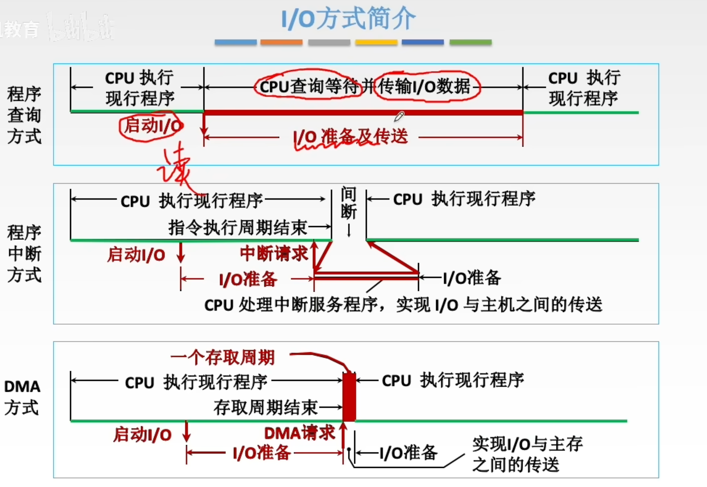
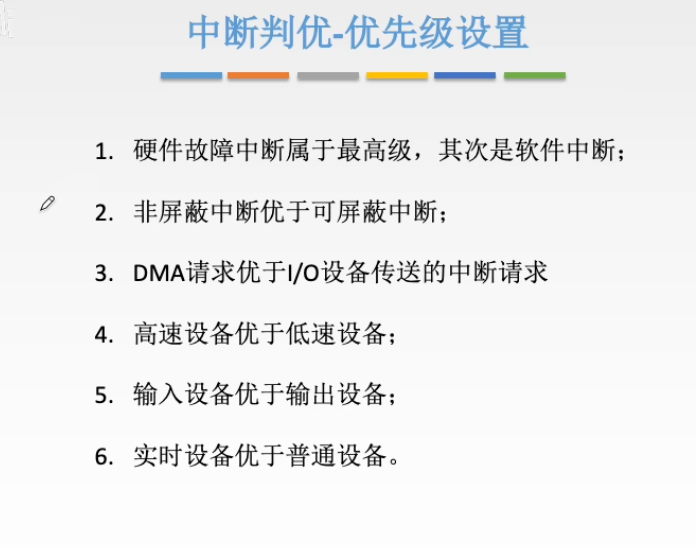
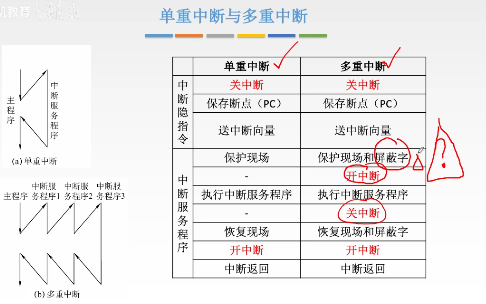
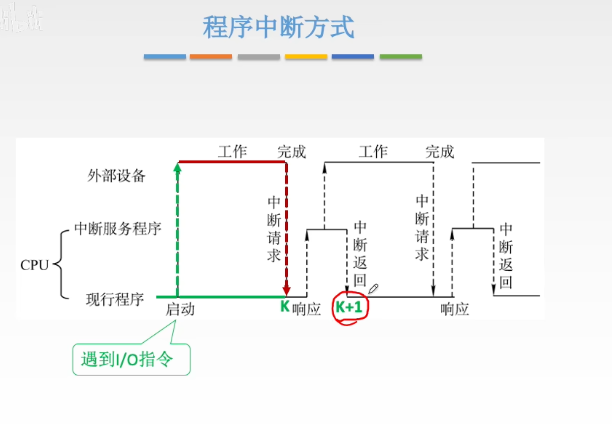
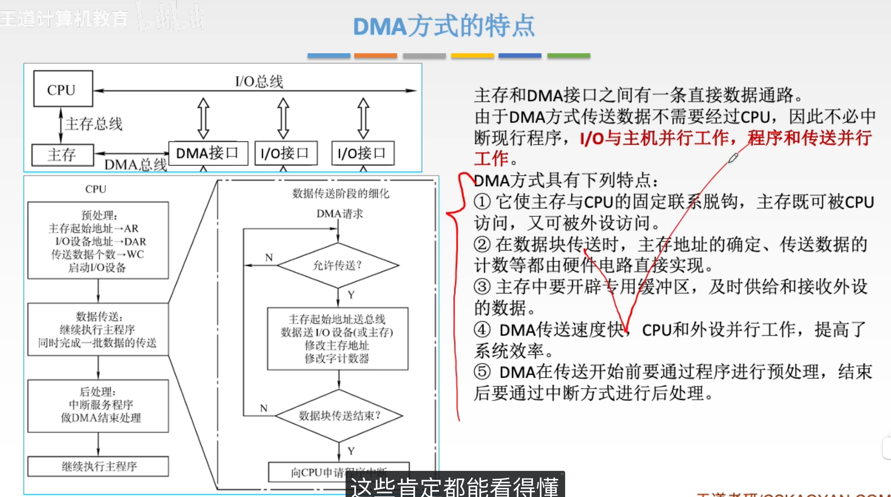
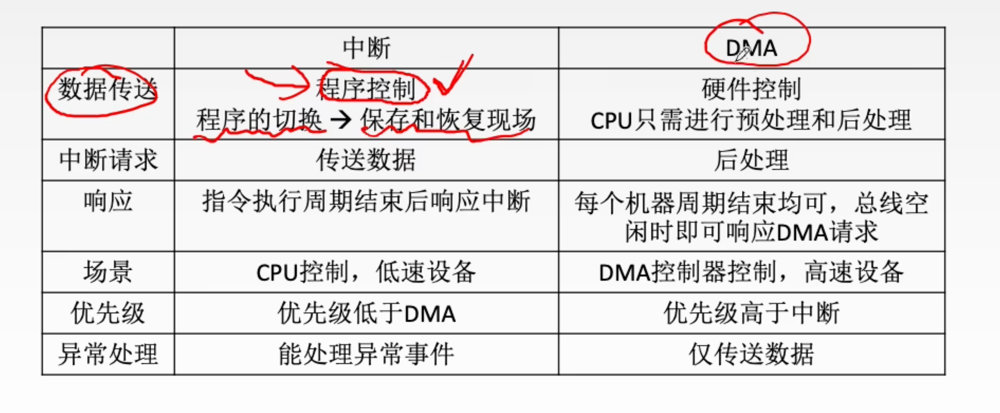
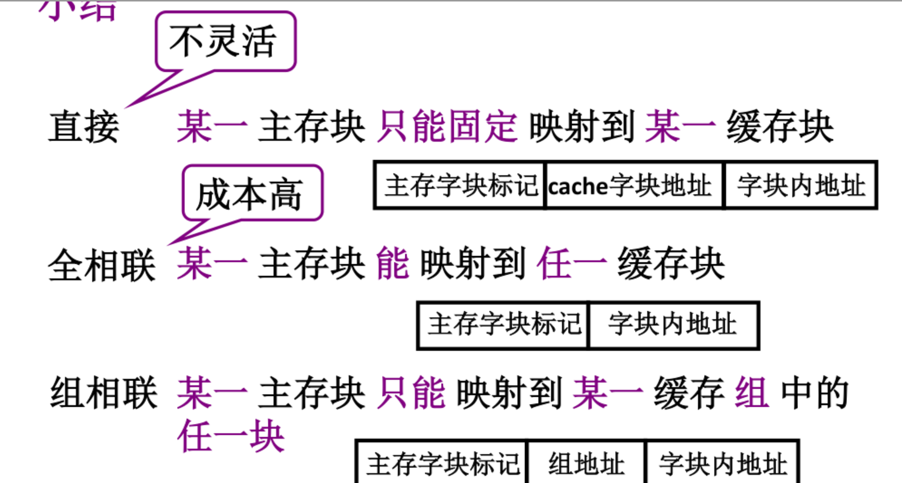
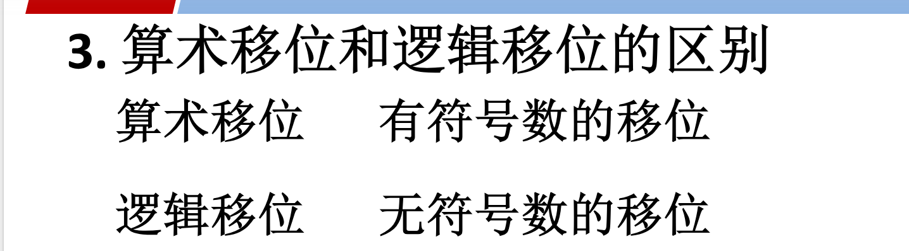

## 1. 定点整数的表示范围

设机器字长为 $n$ 位（包含 1 位符号位，则数值位为 $n-1$ 位）。

### 📊 定点整数范围对照表

| **机器数类型** | **n 位通用公式范围**               | **8位字长具体范围 (n=8)** | **特殊点与坑 ⚠️**                                             |
| -------------- | ---------------------------------- | ------------------------- | ------------------------------------------------------------ |
| **原码**       | $-(2^{n-1}-1) \le X \le 2^{n-1}-1$ | $-127 \le X \le +127$     | 存在 `+0` 和 `-0` 两种表示。                                 |
| **反码**       | $-(2^{n-1}-1) \le X \le 2^{n-1}-1$ | $-127 \le X \le +127$     | 同样存在 `+0` 和 `-0` 两种表示。                             |
| **补码**       | $-2^{n-1} \le X \le 2^{n-1}-1$     | **$-128 \le X \le +127$** | **少了一个0**，负数端多表示一个 $-128$（机器码为 `10000000`）。 |
| **移码**       | $-2^{n-1} \le X \le 2^{n-1}-1$     | **$-128 \le X \le +127$** | 范围与补码完全一致。常用于浮点数阶码，方便比大小。           |

## 2. 定点小数的表示范围

设机器字长为 $n$ 位（包含 1 位符号位，小数点**隐含在符号位之后**，数值位为 $n-1$ 位）。

### 📊 定点小数范围对照表

| **机器数类型** | **n 位通用公式范围**                     | **8位字长具体范围 (n=8)**        | **对应二进制边界 (n=8)**           |
| -------------- | ---------------------------------------- | -------------------------------- | ---------------------------------- |
| **原码**       | $-(1-2^{-(n-1)}) \le X \le 1-2^{-(n-1)}$ | $-(1-2^{-7}) \le X \le 1-2^{-7}$ | `1.1111111` $\sim$ `0.1111111`     |
| **反码**       | $-(1-2^{-(n-1)}) \le X \le 1-2^{-(n-1)}$ | $-(1-2^{-7}) \le X \le 1-2^{-7}$ | `1.0000000` $\sim$ `0.1111111`     |
| **补码**       | **$-1 \le X \le 1-2^{-(n-1)}$**          | **$-1 \le X \le 1-2^{-7}$**      | **`1.0000000`** $\sim$ `0.1111111` |

## 🔍 严谨挑错与核心考点防坑

在大题中，有三个关于范围的绝对高频陷阱，你需要格外注意：

1. **补码小数的 $-1$**：

   在补码小数中，`1.0000000` 表示的真值是 **$-1$**。原码和反码是**无法**表示 $-1$ 的（原码最大只能表示到 $-0.1111111$）。

2. **总个数问题**：

   不管是整数还是小数，对于 $n$ 位二进制来说：

   - 原码和反码因为有 `+0` 和 `-0`，所以总共只能表示 $2^n - 1$ 个**不同的真值**。
   - 补码和移码因为 $0$ 的表示唯一，所以能表示 $2^n$ 个**不同的真值**。

3. **最大正数与最小负数**：

   无论定点整数还是定点小数，补码能表示的**绝对值最大的负数**，其绝对值都比能表示的**最大正数**大 $1$（或大一个最低位权值 $2^{-(n-1)}$）。

## Cache替换算法

1.先进先出

2.近期最少使用

3.随机

## DRAM

集中刷新、分散刷新（没有死区）、异步刷新

