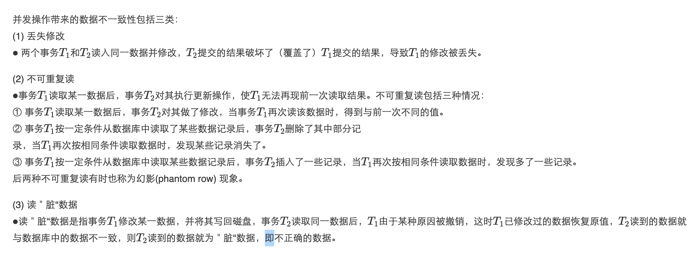
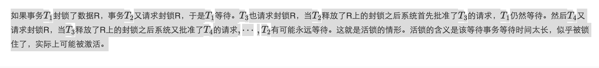

# 【第01章】

**试述关系模型的概念？**

​	关系模型由关系数据结构、关系操作集合和关系完整性约束三部组成。在用户观点下，关系模型中数据的逻辑结构是—张二维表，它由行和列组成。

​       关系模型是建立在严格的集合论和谓词逻辑基础之上的数据模型，它用单一的二维表结构来表示实体及实体之间的联系。在关系模型中，数据的逻辑结构就是一张二维表，每个关系在物理上对应一张基本表。关系的行被称为元组，对应现实世界中的一个实体记录；关系的列被称为属性，每列必须有唯一的属性名且取自同一个域。关系模型要求关系必须是规范化的，即每一个属性都必须是不可再分的原子数据。同时，关系模型包含了完整性约束条件，主要包括保证主码唯一且非空的实体完整性、限制外码取值的参照完整性，以及用户根据业务自定义的完整性。对关系模型的数据操作是基于集合的，用户只需指出“做什么”而无需关心“怎么做”，由数据库管理系统自动实现存取路径，从而保证了很高的数据独立性。

**什么是数据独立性？什么叫数据与程序的物理独立性？什么叫数据与程序的逻辑独立性？为什么数据库系统具有数据与程序的独立性？**

数据与程序的物理独立性：当数据库的存储结构发生改变时，由数据库管理员对模式／内模式映像作相应改变，可以使模式保持不变，从而应用程序也不必改变，这就是数据与程序的物理独立性，简称数据的物理独立性。

数据与程序的逻辑独立性：当数据的逻辑结构即模式改变时，由数据库管理员对各个外模式／模式的映像作相应改变，可以使外模式保持不变，从而应用程序不必修改，这就是数据与程序的逻辑独立性，简称数据的逻辑独立性。

DBMS在三级模式之间提供的两级映像保证了数据库系统中的数据能够具有较高的逻辑独立性和物理独立性。

**数据库的定义及特点**

数据库（Database，简称DB）是长期储存在计算机内、有组织的、可共享的大量数据的集合。

数据库的特点：
① 数据结构化
数据库系统实现整体数据的结构化，这是数据库系统与文件系统的本质区别。
② 数据的共享性高，冗余度低，易扩充。
数据库的数据可以被多个用户、多个应用，用多种不同的程序设计语言共享使用，而且容易增加新的应用，这就使得数据库系统易于扩充，称之为＂弹性大＂。数据共享可以大大减少数据冗余，节约存储空间，同时还能够避免数据之间的不相容性与不一致性。
③ 数据独立性高。
数据独立性包括数据的物理独立性和数据的逻辑独立性。
④ 数据由DBMS 统一管理和控制。
数据库的共享是并发的共享，即多个用户可以同时存取数据库中的数据甚至可以同时存取数据库中同一个数据。为此， DBMS 必须提供统一的数据控制功能，包括：数据的安全性保护、数据的完整性检查、并发控制、数据库恢复。

**数据库管理管理系统（DBMS）的主要功能。**

数据库定义功能；
数据组织、存储和管理功能；
数据操纵功能；
数据库的事务管理和运行管理；
数据库的建立和维护功能；
其他功能，如不同数据库之间的互访和互操作功能等。

**试述数据库系统的组成。**

数据库系统一般由DB、DBMS（及其开发工具）、应用系统、DBA和用户构成。

**试述数据库系统三级模式结构，并说明这种结构的优点是什么？**

数据库系统的三级模式结构由外模式、模式和内模式组成。

∙ 外模式，亦称子模式或用户模式，是数据库用户能够看见和使用的局部数据的逻辑结构和特征的描述，是数据库用户的数据视图。

∙ 模式，亦称逻辑模式，是数据库中全体数据的逻辑结构和特性的描述，是所有用户的公共数据视图。模式描述的是数据的全局逻辑结构。外模式通常是模式的子集。

∙ 内模式，亦称存储模式，是数据在数据库系统内部的表示，即对数据的物理结构和存储方式的描述。

为了能够在内部实现这三个抽象层次的联系和转换，数据库系统在这三级模式之间提供了两级映像：外模式／模式映像和模式／内模式映像。正是这两级映像保证了数据库系统中的数据能够具有较高的逻辑独立性和物理独立性。

**试述数据模型的概念、作用和要素**

数据模型是数据库中用来对现实世界进行抽象的工具，是数据库中用千提供信息表示和操作手段的形式构架。任何一个DBMS 都以某一个数据模型为基础。

数据模型通常由数据结构、数据操作和完整性约束三部分组成。
① 数据结构：描述数据库的组成对象和对象之间的联系，是对系统的静态特性的描述;

② 数据操作：是指对数据库中各种对象（型）的实例（值）允许进行的操作的集合，包括操作及有关的操作规则，是对系统动态特性的描述;

③ 数据的约束条件：是完整性规则的集合，完整性规则是给定的数据模型中数据及其联系所具有的制约依存规则，用以限定符合数据模型的数据库状态以状态的变化，以保证数据的正确有效和相容。

#【第02章】

**关系代数中提供了哪些运算用于查询？其中哪些是基本运算？如何使用这些基本元算来表达其他运算？**

**试述关系数据库的特点**

关系数据库是建立在关系数据模型上的，具有下列优点:
① 关系模型与非关系模型不同，它具有严格的数学基础。
② 关系模型的概念单一，所以其数据结构简单、清晰，用户易懂易用。
③ 关系模型的存取路径对用户透明，从而具有更高的数据独立性、更好的I安全保密性，也简化了程序员的工作和数据库开发建立的工作。

关系数据库的主要缺点包括：
① 由于存取路径对用户透明，查询效率往往不如非关系数据模型。
② 为了提高性能，必须对用户的查询请求进行优化，这就增加了开发RDBMS软件的难度。

**试述等值连接与自然连接的区别和联系。**

自然连接是一种特殊的等值连接，它要求两个关系中进行比较的分量，即连接属性必须是相同的属性组，并且要在结果中去掉一个重复的属性。

**解释以下术语：
① 关系
② 属性
③ 域
④ 元组
⑤ 码
⑥ 分量
⑦ 关系模式
⑧ 关系数据库
⑨ 关系数据库模式**

① 关系 ：一个关系对应通常说的一张表。
② 属性：表中的一列即为一个属性。
③ 域：属性的取值范围。
④ 元组：表中的一行即为一个元组。
⑤ 码：表中的某个属性组，它可以唯一确定一个元组。
⑥ 分量：元组中的一个属性值。
⑦ 关系模式：对关系的描述，一般表示为
关系名（属性1, 属性2, ⋯ , 属性n)
⑧ 关系数据库：数据库中所有关系模式在某一时刻对应的关系的集合。
⑨ 关系数据库模式：关系数据库的型，是对关系数据库的描述，它包括若干域的定义以及在这些域上定义的若干关系模式。

# **【第03章】SQL**

**解释术语：
① 数据定义语言DDL
② 数据操纵语言DML**

① 数据定义语言：用来定义数据库模式、外模式和内模式的语言。
② 数据操纵语言：用来对数据库中的数据进行查询、插入、删除和修改的语句。

**WHERE子句 vs HAVING短语**

① WHERE子句的作用是在分组前筛选数据，HAVING短语的作用是筛选满足条件的组，即在分组之后过滤数据。
② WHERE子句执行顺序和代码位置均在GROUP BY子句之前，HAVING短语的执行顺序和代码位置均在 GROUP BY子句之后。
③ WHERE 子句中不可以包含聚合函数，HAVING短语中可以包含聚合函数。

**斛释相关子查询和不相关子查询**

在嵌套查询中，如果子查询的查询条件不依赖于父查询，称为不相关子查询；如果子查询的查询条件依赖于父查询，称为相关子查询。

# **【第04章】**

**什么是数据库中的自主存取控制（DAC）方法和强制存取控制（MAC）方法？**

∙ 自主存取控制（DAC）
定义各个用户对不同数据对象的存取权限。当用户对数据库访间时首先检查用户的存取权限，防止不合法用户对数据库的存取。自主的含义是用户可以将自已拥有的存取权限“自主”地授予别人，即用户具有一定的“自主”权。
∙ 强制存取控制（MAC）
 每一个数据对象被（强制地）标以一定的密级，每一个用户也被（强制地）授予某一个级别的许可证。系统规定只有具有某一许可证级别的用户才能存取某一个密级的数据对象。

**什么是视图？视图有什么优点？哪类视图是可以更新的，哪类视图是不可更新的？**

∙ 视图是从一个或几个基本表导出的表。视图本身不独立存储在数据库中，是一个虚表。即数据库中只存放视图的定义而不存放视图对应的数据，这些数据仍存放在导出视图的基本表中。

视图在概念上与基本表等同，用户可以如同基本表那样使用视图，可以在视图上再定义视图。

∙ 视图的优点体现在：
1、视图能够简化用户的操作
2、视图使用户能以多种角度看待同一数据
3、视图对重构数据库提供了一定程度的逻辑独立性
4、视图能够为机密数据提供安全保护
5、适当利用视图可以更清晰的表达查询

∙ 基本表的行列子集视图一般是可更新的。若视图的属性来自聚集函数、表达式，则该视图肯定是不可以更新的。

**什么是数据库的安全性？数据库系统中常用的安全控制方法和技术有哪些？**

数据库的安全性是指保护数据库以防止不合法的使用所造成的数据泄露、更改或破坏。

实现数据库安全性控制的常用方法和技术有以下几种。
∙ 用户身份鉴别
系统提供多种方式让用户标识自己的名字或身份。用户要使用数据库系统时由系统进行核对，通过鉴定后才可以使用数据库。
∙ 多层存取控制
系统提供用户权限定义和合法权限检查功能，用户只有获得某种权限才能访问数据库中的某些数据。
∙ 视图机制
为不同的用户定义不同的视图，通过视图机制把要保密的数据对无权存取的用户隐藏起来，从而自动对数据提供一定程度的安全保护。
∙ 审计
建立审计日志，把用户对数据库的所有操作自动记录下来放入审计日志中，审计员可以利用审计信息重现导致数据库现有状况的一系列事件，找出耟去存取数据的人、时间和内容等。
∙ 数据加密
对存储和传输的数据进行加密处理，从而使不知道箭密算法的人无法获知数据的内容。

# **【第05章】**

**什么是触发器？触发器有什么用？触发器由哪些事件激活？**

触发器是一种特殊类型的存储过程，它与数据表或视图相关联。

触发器的主要作用是保证数据的完整性，并实现复杂的业务规则。

触发器由特定的事件激活，包括对表的插入（INSERT）、更新（UPDATE）或删除（DELETE）操作。

**试述关系模型的完整性规则。在参照完整性中，什么情况下外码属性的值可以为空值？**

关系模型中可以有三类完整性约束；实体完整性、参照完整性和用户定义的完整性；关系模型的完整性规则是对关系的某种约束条件。 ① 实体完整性规则：若属性A是基本关系R的主属性，则属性A不能取空值。 ② 参照完整性规则：若属性（或属性组）F是基本关系R的外码，它与基本关系S的主码*K**S*相对应（基本关系R和S不一定是不同的关系），则对于R中每个元组在F上的值必须为下面二者之一： ∙ 或者取空值(F 的每个属性值均为空值）； ∙ 或者等乎S中某个元组的主码值。 ③ 用户定义的完整性：针对某一具体关系数据库的约束条件。它反映某一具体应用所涉及的数据必须满足的语义要求。

通常，覆盖了上述三类完整性规则，**SQL提供了五大约束：**  ① 主键约束（primarykey），  ② 非空约束(notnull)，  ③ 唯一约束（unique），  ④ 检查性约束（check(字段名in(一个合法范围))），  ⑤ 外键约束（primarykey）。

在参照完整性中，如果外码属性不是其所在关系的主属性，外码属性的值可以取空值。

**数据库的完整性概念与数据库的安全性概念有什么区别和联系？**

数据的完整性和安全性是两个不同的概念，但是有一定的联系。

前者是为了防止数据库中存在不符合语义的数据，防止错误信息的输入和输出，即所谓垃圾进垃圾出(Garbage
In Garbage Out) 所造成的无效操作和错误结果；

后者是保护数据库防止恶意破坏和非法存取。

也就是说，安全性措施的防范对象是非法用户和非法操作，完整性措施的防范对象是不合语义的数据。

# 【第06章】关系数据理论

**① 函数依赖
② 完全函数依赖
③ 部分函数依赖
④ 传递依赖
⑤ 1NF
⑥ 2NF
⑦ 3NF
⑧ BCNF**

)

# **【第07章】**

**在进行概念结构设计时，将事物作为属性的基本准则是什么。**

① 属性不能再具有需要描述的性质，属性必须是不可分的数据项，不能包含其他属性；
② 属性不能与其他实体具有联系，即E-R图中所表示的联系是实体之间的联系。

**将E-R 图转换为关系模式时，可以如何处理实体型间的联系**

① 一个1 : 1联系可以转换为一个独立的关系模式，也可以与任意一端对应的关系模式合并；
② 一个1 : n联系可以转换为一个独立的关系模式，也可以与n 端对应的关系模式合并；
③ 一个m:n联系可以转换为一个关系模式；
④ 3个或3个以上实体间的一个多元联系可以转换为一个关系模式；
⑤ 具有相同码的关系模式可合并。

**试述数据库设计过程中形成的数据库模式。**

数据库设计的不同阶段形成数据库的各级模式，即：
① 在概念结构设计阶段形成独立于机器特点、独立于各个DBMS产品的概念模式，在本篇中就是E-R图。
② 在逻辑结构设计阶段将E-R 图转换成具体的数据库产品支持的数据模型，如关系模型，形成数据库逻辑模式，然后在基本表的基础上再建立必要的视图(view) ，形成数据的外模式。
③ 在物理结构设计阶段，根据DBMS特点和处理的需要进行物理存储安排，建立索引，形成数据库内模式。

**试述数据库设计过程。6阶段**

数据库设计过程的6 个阶段：
① 需求分析；
② 概念结构设计；
③ 逻辑结构设计；
④ 数据库物理设计；
⑤ 数据库实施；
⑥ 数据库运行和维护。
设计一个完善的数据库应用系统往往是上述6个阶段的不断反复。

**数据字典的内容和作用是什么？**

数据字典的内容通常包括数据项、数据结构、数据流、数据存储和处理过程5 个部分。其中数据项是数据的最小组成单位，若干个数据项可以组成一个数据结构。数据字典通过对数据项和数据结构的定义来描述数据流、数据存储的逻辑内容。

数据字典的作用；数据字典是关千数据库中数据的描述，在需求分析阶段建立，是下一步进行概念设计的基础，并在数据库设计过程中不断修改、充实和完善。

# **【第11章】**

**登记日志文件时为什么必须先写日志文件，后写数据库？**

把对数据的修改写到数据库中和把表示这个修改的日志记录写到日志文件中是两个不同的操作。有可能在这两个操作之间发生故障，即这两个写操作只完成了一个。
∙ 如果先写了数据库修改，而在运行记录中没有登记这个修政，则以后就无法恢复这个修改了。
∙ 如果先写日志，但没有修改数据库，在恢复时只不过是多执行一次UNDO操作j并不会影响数据库的正确性。

所以一定要先写日志文件，即首先把日志记录写到日志文件中，然后写数据库的修改。

**说明恢复系统是否可以保证事务的原子性和持续性。**

原子性是指操作要么都做，要么都不做，在恢复策略中UNDO可以保证将未成功提交的事务所有操作都取消， REDO可以保证将成功提交的事务所有操作都完成，因此需确保事务的原子性；
持续性是指一旦事务提交，对数据库中数据的改变是永久性的， REDO 可以保证事务只要提交，改变一定被永久实现，因此要确保事务的持续性。

**试述事务的概念及事务的4 个特性。恢复技术能保证事务的哪些特性？**

事务是用户定义的一个数据库操作序列，这些操作要么全做、要么全不做，，是一个不可分割的工作单位。

事务具有4个特性：原子性 、一致性、隔离性 和持续性 。这4个特性也简称为**ACID特性**。
∙ 原子性(Atomicity)
事务是数据库的逻辑工作单位，事务中包括的诸操作要么都做，要么都不做。
∙ 一致性(Consistency) 
事务执行的结果必须是使数据库从一个一致性状态变到另一个一致性状态。
∙ 隔离性(Isolation)
一个事务的执行不能被其他事务于扰。即一个事务内部的操作及使用的数据对其他并发事务是隔离的，并发执行的各个事务之间不能互相干扰。
∙ 持续性(Durability)
也称永久性(permanence) ，指一个事务一旦提交，它对数据库中数据的改变就应该是永久性的。接下来的其他操作或故障不应该对其执行结果有任何影响。

故障恢复可以保证事务的原子性与持续性。

**在系统故障的恢复策略中，为什么UNDO 处理反向扫描日志文件， REDO 处理正向扫描日志文件。**

如果存在同一个数据的多个UNDO 操作，需要将数据恢复到第一个失败事务之前，如果正向扫描处理日志文件无法实现这一目标，因此应该反向扫描日志文件。
对千同一个数据的多个REDO 操作，需要将数据恢复到最后一个成功事务之后，因此应该正向扫描日志文件。

# **【第12章】**

**在数据库中为什么要并发控制？并发控制技术能保证事务的哪些特性？**

数据库是共享资源，通常有多个事务同时在运行。当多个事务并发地存取数据库时就会产生同时读取和／或修改同一数据的情况。

若对并发操作不加控制就可能会存取和存储不正确的数据，破坏数据库的一致性。所以DBMS必须提供并发控制机制。

并发控制可以保证事务的一致性和隔离性。

**并发操作可能会产生哪几类数据不一致？用什么方法能避免各种不一致的情况？**

**么是封锁？基本的封锁类型有几种？试述它们的含义。**

封锁就是事务T 在对某个数据对象(例如表、记录等)操作之前，先向系统发出请求，对其加锁。加锁后事务T 就对该数据对象有了一定的控制，在事务T 释放它的锁之前，其他的事务不能更新或读取此数据对象。

基本的0封锁类型有两种：
① 排他锁（简称写锁或X锁）
∙ 若事务T 对数据对象A加上X锁，则只允许T读取和修改A，其他任何事务都不能再对A加任何类型的锁，直到T 释放A上的锁。这就保证了其他事务在T释放A上的锁之前不能再读取和修改A。
② 共享锁（简称读锁或S锁）
∙ 若事务T对数据对象A加上S锁，则事务T可以读A但不能修改A，其他事务只能再对A加S锁，而不能加X锁，直到T释放A上的S锁。这就保证了其他事务可以读A，但在T释放A上的S锁之前不能对A做任何修改。

**什么是活锁？试述活锁的产生原因和解决方法**

**什么样的并发调度是正确的调度？**

可串行化的调度是正确的调度。
可串行化的调度的定义：多个事务的并发执行是正确的，当且仅当其结果与按某一次序串行地执行它们时的结果相同，称这种调度策略为可串行化的调度。

**请给出检测(诊断)死锁发生的一种方法，当发生死锁后如何解除死锁？**

数据库系统一般采用的方法是允许死锁发生， DBMS检测到死锁后加以解除。

DBMS中诊断死锁的方法与OS类似，一般使用以下两种方法：
① 超时法
∙ 如果一个事务的等待时间超过了规定的时限，就认为发生了死锁。
② 事务等待图法

DBMS并发控制子系统检测到死锁后，就要设法解除。通常采用的方法是选择一个处理死锁代价最小的事务，将其撤销，释放此事务持有的所有锁，使其他事务得以继续运行下去。

**什么是死锁？请给出预防死锁的若干方法**

**完整性约束是否能够保证数据库在处理多个事务时处于一致状态**

完整性约束能够保证操作后的数据满足某种约束条件，并不能使多个事务被正确调度，无法保证数据库处千一致状态。