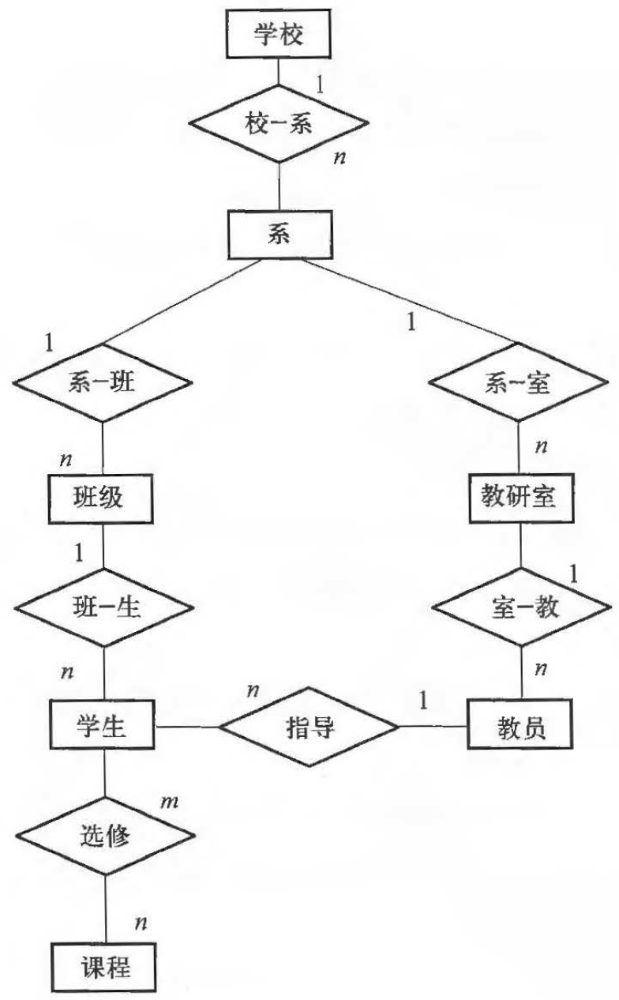
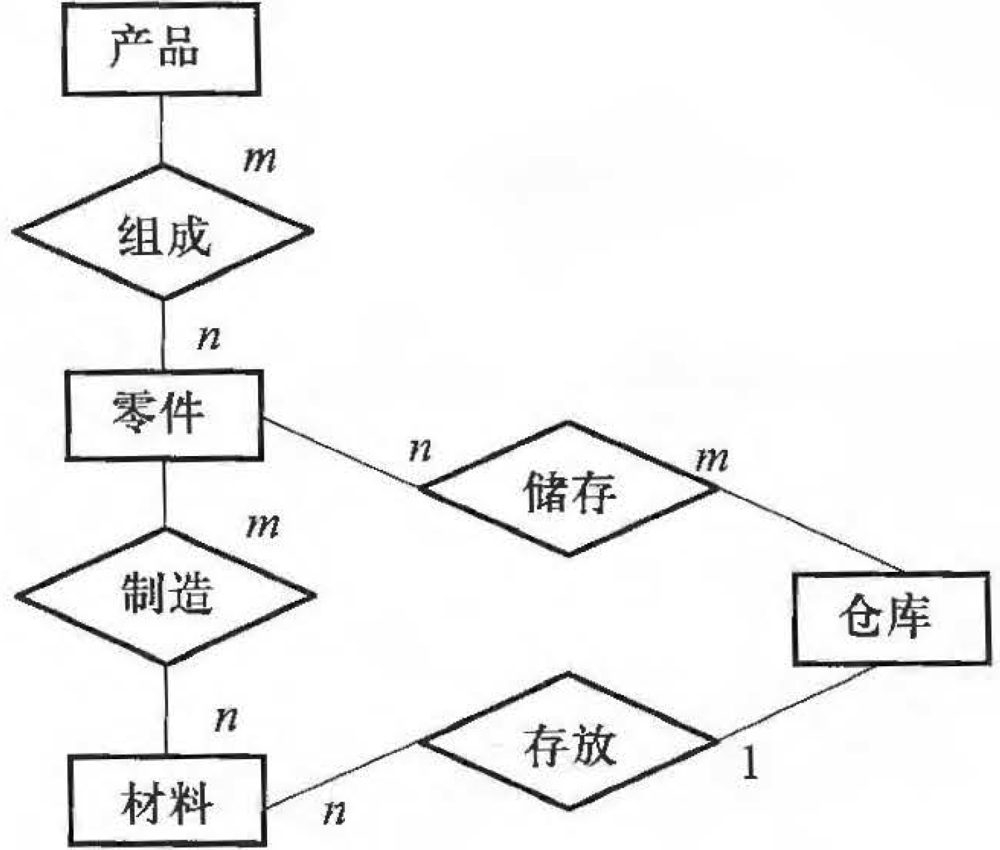
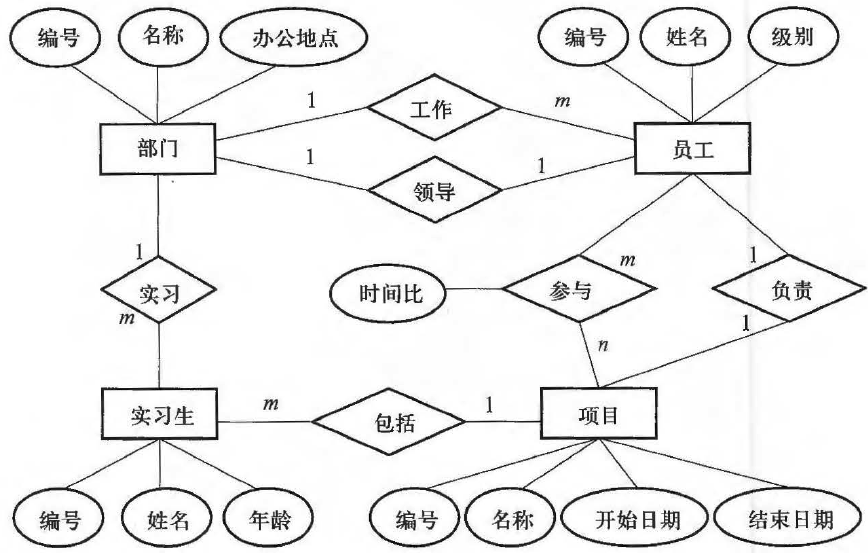
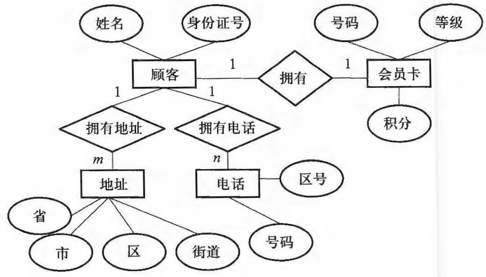
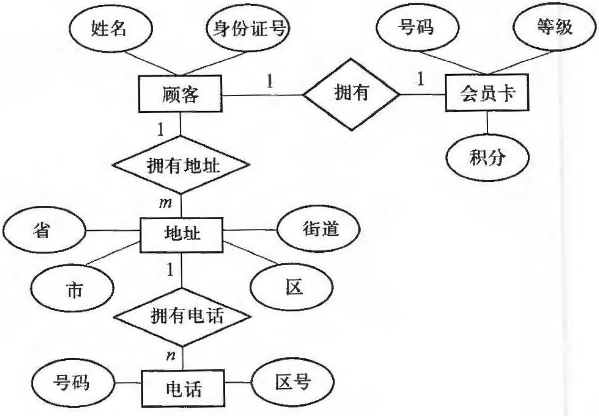

学校中有若干系，每个系有若干班级和教研室，每个教研室有若干教员，其中有的教授和副教授每人各带若干研究生，每个班有若干学生，每个学生选修若干课程，每门课可由若干学生选修。

1、请用E-R图画出此学校的概念模型。
2、把E-R图转换为关系模型，并用下划线标出主码。

)

某工厂生产若干产品，每种产品由不同的零件组成，有的零件可用在不同的产品上。这些零件由不同的原材料制成，不同零件所用的材料可以相同。这些零件按所属的不同产品分别放在仓库中，原材料按照类别放在若千仓库中。

1、请用E-R图画出此工厂产品、零件、材料、仓库的概念模型。
2、把E-R 图转换为关系模型，并用下划线标出主码。

)

假设一个图书馆的数据库至少包括如下信息（其他信息请自己指定）：
① 书库：书库编号、位置、面积
② 图书：书号、书名、出版社
③ 读者：读者号、姓名、单位
④ 管理员：职工编号、职工姓名

另外，用于描述借阅关系的属性包括：借出时间、应还时间等。

要求：
图书按类分别存放在多个书库中，可供读者借阅；
每个书库中有若干个管理员，这些管理员不再管理其它书库。

请绘出书库、图书、读者、管理员及其联系的E-R 图（要求注明相关属性及联系的类型），并将其转换为关系模式（要求注明主码）。

)

假设一个部门的数据库包括如下信息：
职工：职工号、姓名、地址、部门
部门：部门名称、经理名、电话
产品：产品编号、产品名、价格、型号
制造商：厂称、厂址、传真

还包括：
部门销售产品的信息
制造商生产产品的信息

试绘出这个数据库的E-R 图（要求注明相关属性及联系的类型）， 并将其转换成关系模式的集合（要求注明主码）。

)

考虑某个IT 公司的数据库信息：
∙ 部门：部门编号、部门名称、办公地点
∙ 部门员工：员工编号、姓名、级别
∙ 实习生：实习编号、姓名、年龄
∙ 项目：项目编号、项目名称、开始日期、结束日期

若有如下需求：
∙员工只在一个部门工作
∙ 每个部门有唯一一个部门员工作为部门经理
∙ 实习生只在一个部门实习
∙ 每个项目由一名员工负责，由多名员工、实习生参与
∙ 一名员工只负责一个项目，可以参与多个项目，在每个项目具有工作时间比
∙ 每个实习生只参与一个项目

1、画出E-R 图
2、将E-R 图转换为关系模型（包括关系名、属性名、码和完整性约束条件）

)

设某一销售系统的设计过程中需要如下数据：
、、、④、⑤、⑥
① 商品：商品编号、名称、单价
② 顾客：顾客编号、姓名、联系电话

若提供如下语义：
① 一个顾客可购买多种任意商品
② 每次可购买一定数量的商品（一天只限一次购物）

1、请绘出E-R 图，并标明展性和联系的类型。
2、将绘制的E-R图转换为关系模式的集合。

)

设计一个数据库来存储和管理某商场为顾客办理会员卡的信息：
顾客：姓名、地址、电话、身份证号
会员卡：号码、等级、积分
地址：省、市、区、街道
电话号码：区号、号码；

1、按照下列需求画出该系统的E-R 图。
∙ 每个顾客只能办理一张会员卡
∙ 顾客具有多个地址和多个电话号码

2、按照下列需求画出该系统的E-R 图。
∙ 每个顾客只能办理一张会员卡
∙ 顾客具有多个地址
∙ 每个地址具有多个电话号码

)

)