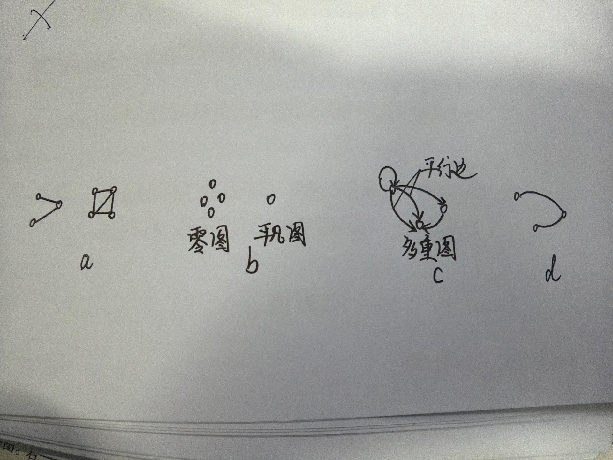

# 图论及其概念

## 引言

​	在离散数学图论的学习中，有很多概念。本文旨在以通俗形式描述他们，配以图像示例，这样在学习时可稍有轻松。

​	图是由一个三元组定义的，顶点、边、还有一个用来表示顶点和边关系的函数，就是这个函数用来指出哪些顶点和边之间有关系、有通路。

## 图的分类

- n阶图：有n个顶点的图称为n阶图。如下图a，为3阶图、4阶图。

- 有限图：如果顶点和边都有限，则称为有限图。

- 零图、平凡图：如果没有边，只有孤立顶点，那么称为零图，如果这个图还是1阶图，那么就是**平凡图**。如下图b。

- 多重图：如果相同的两个顶点之间有多条边，而且这些边是**同向**的，那么就称这些边是**平行边**，含有**平行边**的图称为**多重图**。如下图c。

- 线图：不含环的图。如下图d。如果一个图，平行边和环都没有，那么就是**简单图**。 

  

  ## 结点的度

  ​	对于一个结点，他身上的边称为他的度。

  

  

  