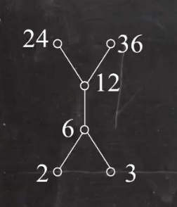
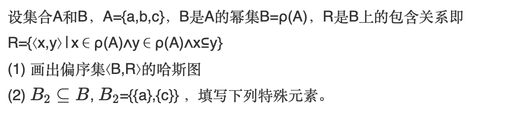
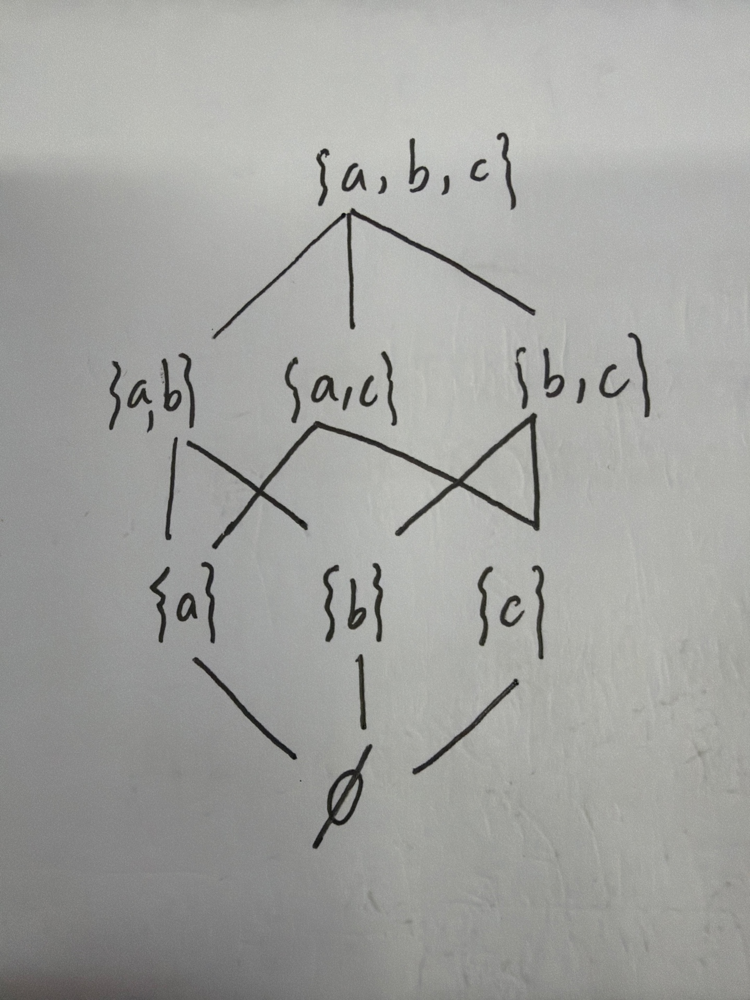
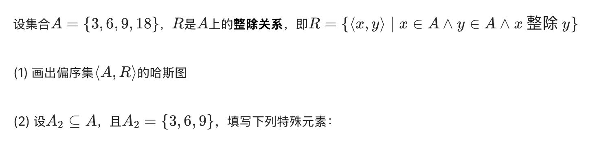
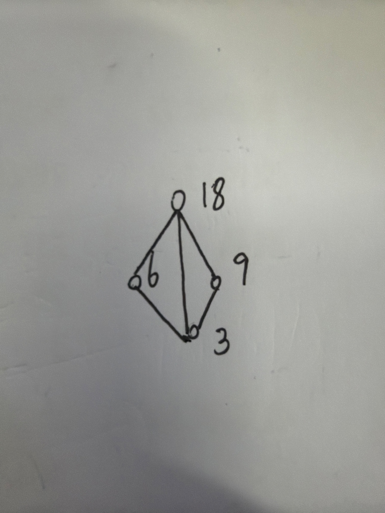

# 离散数学之关系八大元

## 引言 

​	这作为我的学习笔记，因为这八大元很容易混淆，所以给自己看。

## 正文

只有偏序关系中，才会出现八大元，而偏序集可以画出哈斯图，我们以下图为例。（这是一个整除关系的哈斯图）

这一整个都是集合A，而我们取其中的一部分作为子集B。

B我们分别取{6,12} {2,3} {24,36} {2,3,6,12} 作为例子。

### 最大元、最小元

​    最大元最小元可能不存在，若存在，则唯一。他们之间**必须有关系**！他们只能从当前集合B中诞生，和A整体无关。

- 最大元：是从**当前的集合B**中找，看看有没有一个元素能把其他的都盖住，这就是最大元。对于{6,12}，12可以把12和6都盖住，那么12就是最大元，对于 {2,3} ，2和3都不能把对方盖住，而且他们也没关系，那么就不存在最大元。对于{24,36}，也是不能把对方盖住，那么也不存在最大元。对于 {2,3,6,12} ，12可以把2，3，6都盖住，而且还有关系，那么12就是最大元。

- 最小元：和上面一样，也是只从B找，和A没关系。看看能不能找到一个能被B所有其他的元素盖住的元素，这个元素就是最小元。对于{6,12} ，6能被12盖住，6就是最小元。对于{2,3}，他们平级，谁也不能被对方盖住，所以就不存在最小元。对于 {24,36}，也是平级，那么就不存在最小元。而对于 {2,3,6,12} ，2，3都能被其他元素盖住，但是在2，3之间，他俩又是平级，那么由于最小元只有一个，所以就不存在最小元。

  ### 极大元、极小元

​	再放一次图便于查看：

​	 极大元、极小元之间可以没关系。他们只能从当前集合B中诞生，和A整体无关。**极大元、极小元并不唯一**，某些情况下，极大元、极小元可以相同。

- 极大元：对于{6,12}，当前集合再也没有比12大的元素了，那么极大元就是12，对于 {2,3}，当前2，3是最大，那么极大元就是2，3.对于 {24,36}，和前面一样，极大元就是24，36，不要求他俩有关系。对于， {2,3,6,12}显然是最大的12.

- 极小元：对于{6,12}，6是最小的，极小元是6。对于 {2,3}，当前2，3是最小，那么极小元就是2，3 。对于 {24,36}，显然和前面一样，是24，36.对于 {2,3,6,12} ，极小元就是这里面最底层的元素，2，3 。

  ​	最小元和极小元的区别：最小元是当前集合中最小的唯一元素，且与其他的元素都有关系（这里是整除关系），而极小元不要求和其他元素有关系，只要集合里没有比他更小的元素，那么他就是极小元。最大、极大同理。

  **对于哈斯图中的孤立点，既是极大元，又是极小元。**

  ### 上界和上确界

  ​	关于界，不是从B当前集合找，而是要看整体A集合，所有能盖住这个B所有元素的元素，**都是上界**，而上界中最小的那个，就是上确界。但是盖住意味着必须要有关系，不像极大、极小元，可以没关系。

  - 对于{6,12}，A中能盖住他们的是12，24，36，因此都是上界，最小的是12，那么12就是上确界。

  - 对于 {2,3}，A中能盖住他们的是6，12，24，36，所以都是上界，最小的是6，就是上确界。

  - 对于 {24,36} ，A中能盖住他们的没有元素，所以没有上界，也没有上确界。

  - 对于 {2,3,6,12}，A中能盖住他们的是12，24，36，所以他们都是上界，而最小的12就是上确界。

    ### 下界和下确界

    ​	和上界同理，也是从整体A找。只不过下界就是找能被当前集合中盖住的所有元素。这也就意味着必须有关系。但是，下确界是下界中**最大**的那个。
    
  - 对于{6,12}，最小的是6，A中比6还小的有2，3，那么6，2，3都是下界，最大的是6，那么6就是下确界。
  
  - 对于 {2,3}，并没有比他俩小的元素，他们已经是底层，那么就不存在下界，也不存在下确界。
  
  - 对于 {24,36} ，12，6，2，3都能被盖住，所以都是下界，下确界是最大的12 。
  
  - 对于{2,3,6,12} ，显然是不存在更小的元素，因此就不存在下界，也不存在下确界。
  
    以上就是八大元。
  
    ## 练习1
  
    给出了题目，答案。
  
    

注：特殊元素就是八大元。

答案：

画出哈斯图如下：

对于B2，是{{a},{c}},这里为了方便我们不写括号。

- 最大元：由于a，c是平级的，谁也不能盖住谁，所以没有最大元。

- 最小元：由于a，c是平级的，同样也没有最小元。

- 极大元：极大元并不要求a，c有关系，所以a，c是平级的，他们都是极大元。

- 极小元：同理，a，c是极小元。

- 上界上确界：放眼整个集合，{a,c}{a,b,c}都能盖住a，c，所以他们都是上界。最小的上界是{a,c}，所以是上确界。

- 下界下确界：放眼整个集合，最小的只有空集合了，所以空集合既是下界，也是下确界。

  ## 练习2

  

  注：特殊元素就是八大元。

  答案：

  画出哈斯图如下：

  

  A2中有3，6，9。

  - 最大元：6和9都能把3盖住，所以最大元应该从6，9中诞生，但是6，9不具有关系，所以不存在最大元。

  - 最小元：3可以被6，9盖住，所以3是最小元。

  - 极大元：6，9平级，都可以盖住3，所以6，9都是极大元。

  - 极小元：显然是3.

  - 上界上确界：放眼整个A集合，能同时盖住3，6，9的只有18，因此上界和上确界都是18 。

  - 下界下确界：放眼整个A集合，3可以被所有元素盖住，所以3既是下界，也是下确界。

End.

​    

​    

  

  

