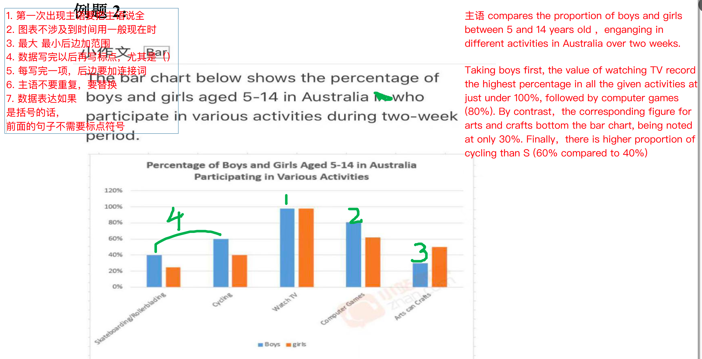

The bar chart shows the proportion of teenagers aged 5-14 in Australia who take part in different activities in half month period.

Taking boys first, the value of watching TV record the highest percentage in all the given activities at just under 100%,  followed by computer games(80%). By contrast, the corresponding figure for arts and crafts bottom the bar chart, being noted at only 30%. Finally, there is higher proportion of cycling than skateboarding or rollerblading(60% compared to 40%).

Next  is the girls.There was a tiny difference between boys and girls in watching TV, being noted at nearly 100%. Computer games had the second highest percentage at 60%.Besides, the arts and crafts accounting for 45%, closely followed by cycling, at 40%. Finally, there was only nearly 20% of girls engaged in  skateboarding or rollerblading.

To conclude,  boys and girls have minor disparities in watching TV. And the proportions of boys and girls playing computer games, cycling and  skateboarding/rollerblading, are both that boys outnumber girls. However,  arts and crafts is the only activity that the rate girls more than boys.

 

