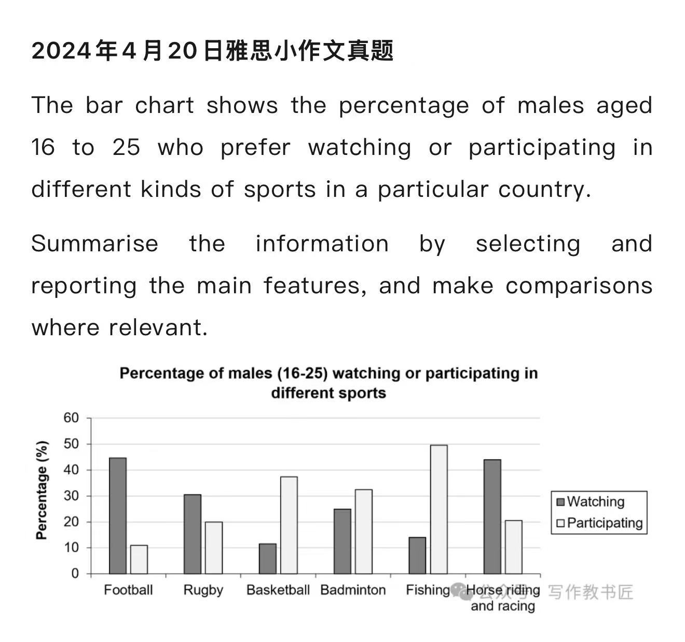

The bar chart shows compares the proportion of young men between 16 and 15 old preferring watching or participating in various sports in a certain country.

Taking watching first, the figures for watching football and horse riding &racing are same and by far the heighest in all the given sports (about 45%). By contrast, the corresponding  proportion of baskertball bottom the bar chart at only 11%. Besides, there is a noticeably higher value of rugby than badminton (30% compared to 25%). Finally, there is 15% of youngsters perferring watching fishing. 

Turing to participating, fishing is the most popular activity among young men, which accounts for 50%. Following fishing in terms of popularity is basketball, with 38% of young choosing this sport. Additionally, rugby equaled the figure recorded for horse riding and racing(20%). Badminton is almost 3 times as football, about 35%.

Summarize  

