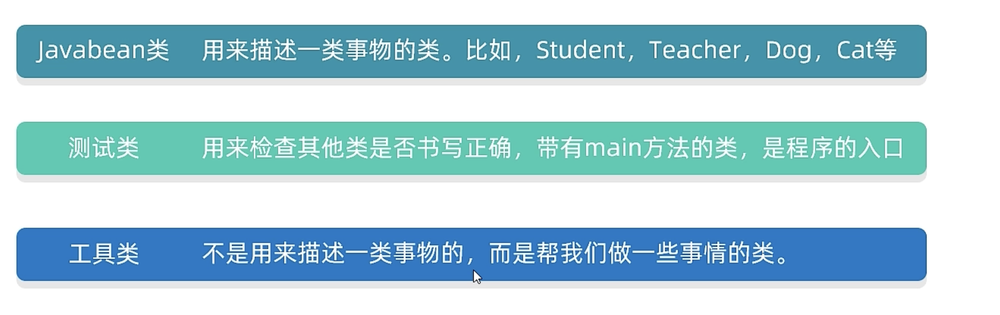

# Java之面向对象进阶之static关键字

## 引言

面向对象是Java的特点，Java的一切都是基于面向对象的。这个是一个进阶教程。

## static关键字修饰成员变量

首先，我们创建一个学生类：

```java
package com.annypst.OOP;

/**
 * 学生类，用于表示一个学生对象
 */
public class Student {
    private String name;
    private int age;
    public String school;

    public void setSchool(String school) {
        this.school = school;
    }

    public String getSchool() {
        return school;
    }

    /**
     * 获取学生的名字
     * @return 学生的名字
     */
    public String getName() {
        return name;
    }

    /**
     * 获取学生的年龄
     * @return 学生的年龄
     */
    public int getAge() {
        return age;
    }

    /**
     * 设置学生的名字
     * @param name 学生的新名字
     */
    public void setName(String name) {
        this.name = name;
    }

    /**
     * 设置学生的年龄
     * @param age 学生的新年龄
     */
    public void setAge(int age) {
        this.age = age;
    }

    /**
     * 表示学生正在吃饭
     */
    public void eat(){
        System.out.println(name+"学生正在吃饭");
    }
}

```

然后再给这个类写个测试类，创建几个对象：

```java
package com.annypst.OOP;

public class StudentTest {
    public static void main(String[] args) {
        Student s1=new Student();
        Student s2=new Student();
        s1.setName("John");
        s1.setAge(18);

        s2.setName("Jane");
        s2.setAge(17);

        s1.eat();
        s2.eat();

        

    }
}

```

结果：

`John学生正在吃饭
Jane学生正在吃饭`

但是，我现在给他们再加一个输出学校的方法：

```
 public void printschool(){
        System.out.println(name+"的学校是 "+school);
    }
```

接下来打印：

`John学生正在吃饭
Jane学生正在吃饭
John的学校是 school1
Jane的学校是 null`

显然这样不合理，他们的学校应该是一样的。但是难道要一个一个赋值吗？假如有10000个学生，如果一个一个赋值就会很麻烦。所以我们给school变量加上static关键字，这样，school变量就变成了常量，被所有对象共享。

```java
 public static String school;
```

我们弄一堆学生，但只给第一个的学校赋值：

```java
 Student s1=new Student();
        Student s2=new Student();
        Student s3=new Student();
        Student s4=new Student();
        s1.setSchool("school1");
        s1.printschool();
        s2.printschool();
        s3.printschool();
        s4.printschool();
```

结果：

`null的学校是 school1
null的学校是 school1
null的学校是 school1
null的学校是 school1`

null是因为我们没有给这些对象赋值名字，但是可以看到，不同的对象，学校却是一样的。

加了static关键字以后，就不用this访问了，也不用对象名访问，而是可以直接使用类名访问，因为他这会儿是属于整个类而不是某个对象的：

```java
 Student s1=new Student();
        Student s2=new Student();
        Student.school="s1";
        s1.setName("John");
        s1.setAge(18);
        s2.setName("Jane");
        s2.setAge(17);
        s1.eat();
        s2.eat();
        s1.printschool();
        s2.printschool(); 
```

`John学生正在吃饭
Jane学生正在吃饭
John的学校是 s1
Jane的学校是 s1`

> [!NOTE]
>
> 这时的school叫做静态变量，他有这些特点：
>
> • 被该类所有对象共享
>
> 调用方式：
>
> - 类名调用（推荐）
> - 对象名调用 

> [!IMPORTANT]
>
> 这些静态变量，存储在堆内存的静态区里。静态变量是随着类的加载而加载的，优先于对象出现的。

## static关键字修饰成员方法

现在，static用来修饰成员方法。

> [!NOTE]
>
> 特点：
>
> - 多用在测试类和工具类中
> - Javabean类中很少会用
>
> 调用方式：
>
> - 类名调用（推荐）
> - 对象名调用

现在，区分常见的3个类：



工具类要构造方法私有化，因为工具类是帮我们做事的，并不代表一类对象。

方法都定义成静态的。


## static的注意事项

 1.静态方法只能访问静态变量和静态方法

2.非静态方法可以访问静态变量或者静态方法，也可以访问非静态的成员变量和非静态的成员方法
2.静态方法中是没有this关键字   

> [!NOTE]
>
> 总结：静态方法中，只能访问静态。
>
> 非静态方法可以访问所有。
>
> 静态方法中没有this关键字

