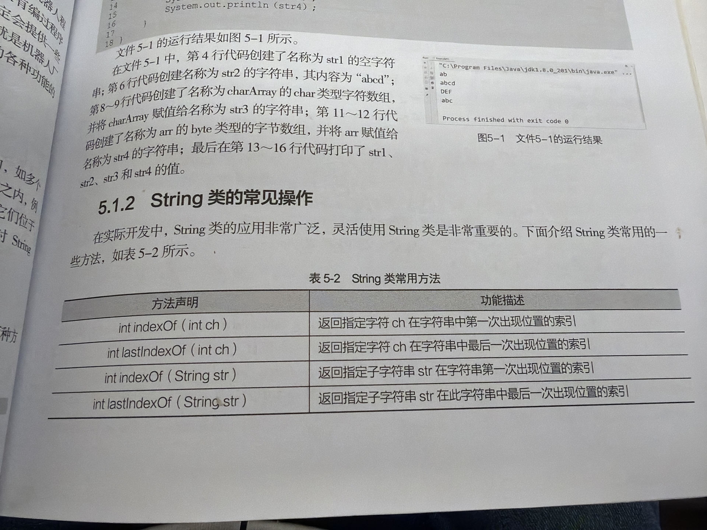
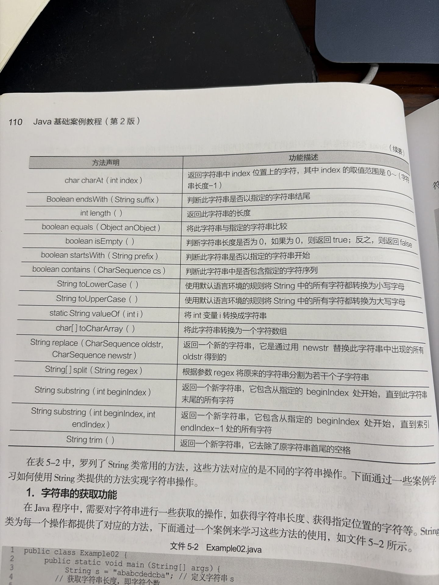
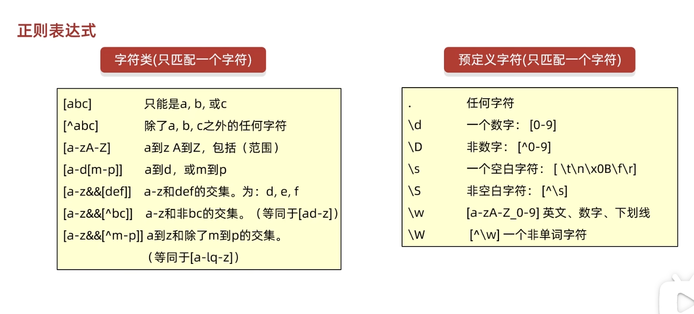
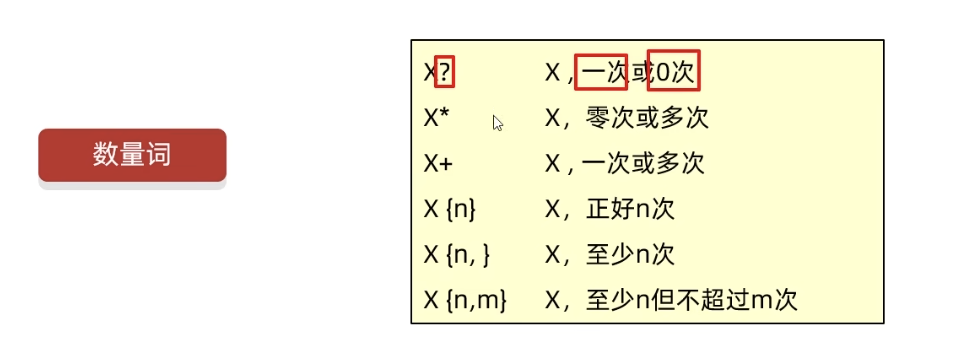
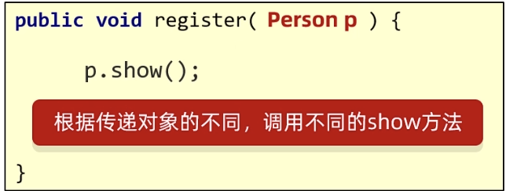
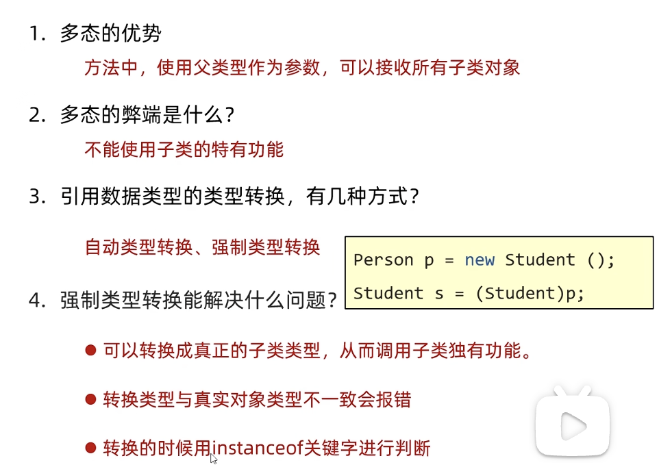
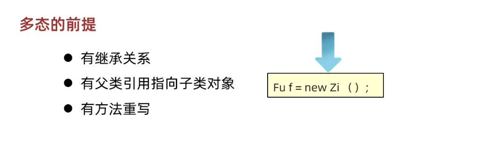
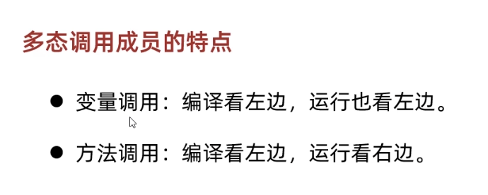

# Java复习

# **基础知识：**

## 标识符

Java标识符可以用字母数字下划线和美元符号，但是不能用数字开头。


## 方法重载、重写

重载 Overload 是指方法名一样，但是形参列表里的参数不一样，比如add方法有好几个，但是我想实现不同数据类型的加法，参数不一样。发生在**同一个类中**，多个方法拥有**相同的方法名**，但**参数列表不同**（参数个数、类型、顺序），与返回值、修饰符无关，是「编译时多态」。

重写 Override 发生在**父子类（或接口与实现类）之间**，子类定义一个与父类（或接口）**方法名、参数列表、返回值类型完全一致**（特殊情况可兼容）的方法，覆盖父类方法的实现，是「运行时多态」。


## 类成员、类方法

 一、 类成员（成员变量 / 实例变量，非静态成员变量）

类成员（通常简称「成员变量」）是定义在类中、方法体外的**非静态变量**，属于对象（实例）所有，也叫「实例变量」。

1. **定义位置与语法**
   - 定义在类内部，所有方法（包括构造方法、成员方法）外部。
   - 语法格式：`[访问修饰符] [其他修饰符] 数据类型 变量名 [= 初始化值];`
   - 示例：`public String name;`、`private int age = 18;`
2. **所属对象，而非类**
   - 成员变量属于**单个对象（实例）**，每个对象都会独立拥有一份该变量的副本，修改一个对象的成员变量不会影响其他对象。
   - 示例：创建两个`Person`对象，`person1.name = "张三"`不会改变`person2.name`的值。
3. **初始化与默认值**
   - 无需显式初始化，Java 会为其分配「默认初始值」（局部变量无此特性），默认值规则如下：
     - 基本数据类型：`byte/short/int/long`→0；`float/double`→0.0；`char`→'\u0000'（空字符）；`boolean`→false。
     - 引用数据类型（`String`、数组、自定义类等）→`null`。
   - 可显式初始化（定义时赋值），或在构造方法、初始化块中赋值。
4. **访问方式**
   - 必须先创建类的实例（对象），通过「`对象名.成员变量名`」访问。
   - 类的内部（成员方法、构造方法中），可直接通过变量名访问（隐含`this.变量名`）。
   - 静态方法中**无法直接访问**成员变量（静态方法属于类，无对象实例，无法获取对象专属的成员变量）。
   - 示例：`Person p = new Person(); p.name = "李四";`
5. **可使用的修饰符**
   - 访问修饰符：`public`、`protected`、`default`（包访问权限，不写修饰符）、`private`。
   - 其他修饰符：`final`（常量，赋值后不可修改）、`transient`（序列化忽略）、`volatile`（保证可见性，禁止指令重排）。
   - 不可使用的修饰符：`static`（加`static`即为静态变量，不属于成员变量）、`abstract`（抽象修饰符不适用变量）。
6. **作用域与生命周期**
   - 作用域：整个类内部可访问（受访问修饰符限制），外部需通过对象访问（受访问修饰符限制）。
   - 生命周期：与对象绑定，对象被创建（`new`）时分配内存，对象被垃圾回收（GC）时销毁，随对象的生命周期而变化。
7. **与局部变量的核心区别**
   - 局部变量定义在方法 / 代码块中，成员变量定义在类中、方法外。
   - 局部变量无默认值，必须显式初始化后才能使用；成员变量有默认值。
   - 局部变量属于方法 / 代码块，生命周期随方法 / 代码块执行结束而销毁；成员变量属于对象，生命周期随对象。

 二、 类方法（静态方法，`static`修饰的方法）

类方法是用`static`修饰的方法，定义在类中，属于类本身所有，而非对象（实例）所有。

1. **定义位置与语法**
   - 定义在类内部，方法体外（可与成员变量交替定义）。
   - 语法格式：`[访问修饰符] static [返回值类型] 方法名([参数列表]) [throws 异常列表] { 方法体 }`
   - 示例：`public static void showInfo() {}`、`private static int add(int a, int b) { return a+b; }`
2. **所属类，而非对象**
   - 类方法属于**类本身**，所有对象共享同一份类方法副本，无需创建对象即可调用。
   - 即使通过对象调用类方法（`对象名.类方法名()`），编译器也会自动转换为「类名。类方法名 ()」，本质还是类调用。
3. **访问限制：仅能直接访问静态成员**
   - 类方法中**可直接访问类的静态变量（类变量）和其他静态方法**（无需创建对象，同属类本身）。
   - 类方法中**无法直接访问非静态成员变量（成员变量）和非静态方法（成员方法）**（必须手动创建类的实例，通过「实例。非静态成员」访问）。
   - 原因：类方法调用时可能不存在任何对象实例，而非静态成员依赖于对象实例。
4. **访问方式**
   - 推荐方式：「`类名.类方法名()`」，直接通过类名调用，无需创建对象。
   - 不推荐方式：「`对象名.类方法名()`」，语法合法但可读性差，容易混淆为成员方法。
   - 类内部（静态方法 / 成员方法中），可直接通过方法名调用同类的静态方法（省略「类名.」）。
   - 示例：`Math.max(10, 20);`（JDK 自带静态方法）、`Person.showClassName();`
5. **可使用的修饰符**
   - 访问修饰符：`public`、`protected`、`default`、`private`。
   - 其他修饰符：`final`（无法被子类重写，仅能被隐藏）、`synchronized`（同步锁，锁的是类对象）、`native`（本地方法）。
   - 不可使用的修饰符：`abstract`（抽象方法无方法体，静态方法必须有方法体，二者冲突）、`this`/`super`（静态方法中无对象实例，无法使用`this`和`super`关键字）。
6. **作用域与生命周期**
   - 作用域：受访问修饰符限制，整个类内部可直接调用，外部可通过「类名。方法名」调用（符合访问权限）。
   - 生命周期：与类绑定，类被类加载器加载（JVM 启动 / 首次使用类时）时初始化，类被卸载（极少发生）时销毁，生命周期贯穿整个类的存在周期。
7. **核心特性与使用场景**
   - 无`this`引用：静态方法中不存在`this`关键字（`this`指向当前对象实例），也无法使用`super`关键字（指向父类对象实例）。
   - 无法被重写（Override）：子类可定义与父类同名的静态方法，这是「方法隐藏」而非「方法重写」，不具备运行时多态特性。
   - 适用场景：工具类方法（如`java.util.Arrays`、`java.lang.Math`）、无需依赖对象状态的方法、全局共享的功能方法。

 三、 补充：类成员 / 类方法与实例成员 / 实例方法的核心对比

| 对比维度   | 类成员（静态变量）/ 类方法（静态方法） | 实例成员（成员变量）/ 实例方法（成员方法）   |
| ---------- | -------------------------------------- | -------------------------------------------- |
| 所属对象   | 类本身                                 | 类的单个对象（实例）                         |
| 访问方式   | 类名.xxx（推荐）、对象名.xxx（不推荐） | 对象名.xxx、类内部隐含 this.xxx              |
| 默认值     | 类变量有默认值（同成员变量）           | 成员变量有默认值，实例方法无默认值（需实现） |
| 相互访问   | 仅能直接访问静态成员                   | 可直接访问静态成员和实例成员                 |
| 生命周期   | 随类加载而初始化，随类卸载而销毁       | 随对象创建而初始化，随对象 GC 而销毁         |
| 关键字支持 | 不支持`this`/`super`                   | 支持`this`/`super`                           |

总结

1. 类成员（实例变量）：属于对象，有默认值，随对象生命周期变化，仅能通过对象访问。
2. 类方法（静态方法）：属于类，无需对象即可调用，仅能直接访问静态成员，生命周期与类绑定。
3. 核心区分点：「所属主体」（类 vs 对象），这决定了二者的访问方式、生命周期和相互访问限制。
4. 实用原则：无需依赖对象状态的功能，优先使用静态方法 / 静态变量；需要封装对象状态的，使用实例成员 / 实例方法。

## 访问权限


private default protected public


## Lambda表达式


只能简化函数式接口的匿名内部类。

有且仅有**一个**抽象方法的接口，称为函数接口。


```java
package com.annypst;

public class lambda {
    @FunctionalInterface
    public interface swimming{
        public abstract void swim();
    }

    public static void method(swimming s){
        s.swim();
    }

    public static void main(String[] args) {
        method(
                ()->{
                    System.out.println("swimming...");
                }
        );
    }


}

```

```java
 public static void main(String[] args) {
        Integer[] arr={2,3,1,6,5,4,9,7,8,0};
        Arrays.sort(arr,(o1,o2)->o1-o2);
        System.out.println(Arrays.toString(arr));
    }
```


## 多线程

线程创建：

1.继承Thread类

```java
	class Mythd extends Thread{
    public void run()/*some code to running*/{
      System.out.println("is running!!!");
    }
  }

	psvm{
  	Mythd m1=new Mythd();
    m1.start();//open thread
    
}
```

2.实现Runnable接口

```java
package com.annypst.Threading;

public class thd {
    public static class mythd implements Runnable{
        public void run(){
            while (true)
            System.out.println("running...");
        }
    }

    public static void main(String[] args) {
        mythd m1=new mythd();
        Thread s1=new Thread(m1);//creating thread
        s1.start(); //starting thread
    }
}


```

注意第二种方法是要用Thread对象运行线程。

Thread.sleep(ms) 、synchronized(Obj Lock)同步线程方法

Thread.yield() 线程让步

t.join()线程插入，t线程优先执行

**线程生命周期**：

新建new 创建了这个线程对象

就绪runnable 调用了start方法

运行running 抢占到了CPU的资源

阻塞blocked 被挂起、失去了cpu资源、调用sleep方法、wait方法（使用notify唤醒）、调用另一个线程的join方法

死亡terminated 调用stop方法，或者正常运行完毕、或者抛出异常、产生错误。

```java
package com.annypst.Threading;

public class TicketSale {

    public static void main(String[] args) {

        sale s1=new sale();
        new Thread(s1,"one").start();
        new Thread(s1,"two").start();
        new Thread(s1,"three").start();
        new Thread(s1,"four").start();


    }

    public static class sale implements Runnable{
        private int ticketcount=10;
        public void run(){
            while (ticketcount>0){//当票数大于0时，一直循环

                try {
                    Thread.sleep(1);//这就会造成线程不安全
                } catch (InterruptedException e) {
                    throw new RuntimeException(e);
                }

                System.out.println("Thread No "+Thread.currentThread()+"售出了票"+ticketcount--);//售出票
            }
        }

    }
}

```

同步块

```java
 while (true) {//当票数大于0时，一直循环
                synchronized (lock) { //同步
                    try {
                        Thread.sleep(10);//这就会造成线程不安全
                    } catch (InterruptedException e) {
                        throw new RuntimeException(e);
                    }
                    if (ticketcount > 0)
                        System.out.println("Thread No " + Thread.currentThread() + "售出了票" + ticketcount--);//售出票
                    else break;
                }
            }

```

同步方法 

被synchronized修饰的方法一个时刻只允许一个线程访问，其他线程都会发生阻塞。

## 异常处理

异常体系，最上层的父类是Exception


try catch finally

```java
package com.annypst.Exception;

public class exp1 {
    public static void main(String[] args) {
        try{
            int[] arr={1,2,3};
            System.out.println(arr[3]);
        }
        catch (Exception e){
            System.out.println("has exception "+e);
        }
        finally {
            System.out.println("over.");
        }
        }

}

```


自定义异常


## 接口

   注意：接口中的抽象方法默认会自动加上public abstract修饰程序员无需自己手写！！
       按照规范：以后接口中的抽象方法建议不要写上public abstract。因为没有必要啊，默认会加上。

 在接口中定义的成员变量默认会加上： public static final修饰。

implements


## 泛型

- 泛型的介绍

​	泛型是JDK5中引入的特性，它提供了编译时类型安全检测机制

- 泛型的好处

  1. 把运行时期的问题提前到了编译期间
  2. 避免了强制类型转换
- 泛型的定义格式

  - <类型>: 指定一种类型的格式.尖括号里面可以任意书写,一般只写一个字母.例如: <E> <T>
  - <类型1,类型2…>: 指定多种类型的格式,多种类型之间用逗号隔开.例如: <E,T> <K,V>


多态的弊端是不能调用子类的特有功能，

泛型可以在其他很多地方进行定义，比如方法、类、接口


泛型方法：使用类名后面定义的泛型 ，所有方法都可以用

在方法上声明自己的泛型，只有本方法能用

```java
package com.annypst.fanxing;

import java.util.ArrayList;
import java.util.Iterator;

public class fanxing {
    public static void main(String[] args) {
        ArrayList<Integer> list=new ArrayList<>();

        Fanlei<Integer> f1=new Fanlei<>();
        f1.add(list,1,2,3,4,5);

    }
    public static class Fanlei<e>{

        public void add(ArrayList<e> l1,e...ele){
            for(e i:ele){
                l1.add(i);
            }
            Iterator<e> it=l1.iterator();
            while(it.hasNext()){
                e st=it.next();
                System.out.println(st);
            }
            System.out.println(l1.toString());
        }
    }
}


```


## JDBC

其好处是统一了不同厂商数据库的接口规范，不用改变大量代码，是应用程序和数据库中间的桥梁。

常用api：

- Driver接口：必须实现的接口，提供给数据库厂商用。

- DriverManager接口：加载驱动程序，建立连接：

  > static void registerDriver(Driver d1);  static Connection getConnection(String url ,String user ,String pwd);

- Connection接口：表示数据库连接的对象。

- Statement接口：执行静态SQL语句，返回一个结果对象

- PreparedStatement接口：更安全地执行语句，而且可以将程序里的变量作为参数

- ResultSet接口：返回结果集。

## 数组


## 常见类（字符串等）

字符串等:







## 反射

Class类代表的是class对象

实例化class对象的方法：

```java
//获取class对象的3种方法
Class.forName("FULL class_name");//源代码阶段
类名.class;//加载到内存阶段
对象.getClass();//创建对象阶段（运行阶段）    
```


反射获取构造方法：

​	获取所有公共的：getConstructors()

​	获取所有的，包括私有的：getDeclaredConstructors()

反射获取成员变量属性：

​	获取所有公共的：getFields()

​	获取所有的，包括私有的：getDeclaredFields()

反射获取成员方法：

​	获取所有公共的：getMethods()

​	获取所有的，包括私有的：getDeclaredMethods()

反射获取接口：

​	getInterfaces()

获取权限:

​	使用getModifiers()

Object invoke （object obj, Object... args）： 运行反射获取到的方法

## GUI基础

Jframe

Jdialog：可用来创建模态非模态对话框。 

## 流的基本概念

Java 中的**流（Stream）**，可以理解为**一组有序的、连续的字节 / 字符数据的传输通道（或数据序列）**。


## 匿名类、内部类

內部類：成员内部类、局部内部类（位于方法中），注意生效范围、静态内部类（用static关键字修饰的成员内部类，只能访问外部类的静态成员）

```java
package com.annypst;

public class InnerAndOuter {

    public static void main(String[] args) {
       Outer o1=new Outer();
       o1.test();
    }
}
class Outer {
    class Inner {
        //这是内部类
        public void show() {
            System.out.println("我是内部类");
        }
    }
    public void test() {
        Inner n1 = new Inner();
        n1.show();
    }

}
```


匿名内部类：没有名称的内部类，new 父接口（）{}

```java
package com.annypst;
public class niming {
    interface Animal{
        void shout();
    }
    public static void dongwujiao(Animal an){
        an.shout();
    }
    public static void main(String[] args) {
        dongwujiao(
                new Animal(){
                    @Override
                    public void shout() {
                        System.out.println("匿名类，实际上是一只dog，正在叫");
                    }
                }
        );
    }
}
```


## 类和接口的定义、使用

class

implements 接口1，接口2，。。。。。。

接口只能含有常量和抽象方法


## 数据类型分类

Java 的数据类型整体分为两大核心类别：**基本数据类型（Primitive Data Type）** 和 **引用数据类型（Reference Data Type）**。

基本数据类型是 Java 内置的简单数据类型，**直接存储数据值本身**，不涉及对象引用，占用固定大小的内存空间，分为 4 大类 8 种。

引用数据类型不直接存储数据值，**存储的是对象在堆内存中的引用地址（内存指针）**，通过该地址可以访问到堆中的实际对象数据，占用内存大小不固定（由对象内容决定）。（类、接口、数组）


## this、super、static

- this的使用场景

(1)使用 this 关键字调用本类中的属性。当实例变量和局部变量同名时，可以使用 this 关键字解决命名冲突。 

(2)使用 this 关键字调用成员方法。大多数此处的 this 可以省略不写。编译器在碰到方法调用时，会默认认为你指的是当前对象的实例方法，除非上下文明确提供了其他解释。 

(3)使用 this 关键字调用本类的构造方法。构造方法在实例化对象时被java 虚拟机自动调用，在程序中不能像调用其他成员方法一样调用构造方法，但可以在构造方法中使用“this(参数 1，参数 2…)” 的形式调用其他构造方法。

- super的使用场景

(1)使用 super 关键字访问父类的成员方法和成员变量 super.成员变量 super.成员方法（参数 1，参数 2，…） 

(2)使用 super 关键字访问父类中指定的构造方法。 super(参数 1，参数 2，…)

注意：(1)默认情况下，子类全部构造器的第一行代码都是super()(写 不写都会有) (2)如果父类没有无参数构造器，则我们必须在子类构造器第一行手写 super(),指定去调用父类的有参数构造器。 (3)super（ ）调用父类构造器的代码必须位于子类构造方法的第一行，并且只能出现一次。

- static的使用场景

(1)修饰变量。用于定义类变量，被修饰的变量属于类本身，所有类的实例共享此变量，可通过类名直接访问和修改。不能修饰局部变量。

(2)修饰方法。定义静态方法，属于类而非类的实例。可直接通过类名调用，且只能访问类中的静态成员。在调用时不需要创建对象。

(3)静态代码块。用于在类加载时执行一次特定的初始化代码，通常用于初始化静态变量等操作。

(4)静态内部类。修饰内部类时，使其成为静态内部类，不依赖外部类实例而存在，能直接访问外部类的静态成员。

 

## equals()方法

| 对比维度         | == 运算符                                                    | equals () 方法                           |
| ---------------- | ------------------------------------------------------------ | ---------------------------------------- |
| 本质作用         | 判断「引用地址是否相同」（是否指向同一个对象）               | 判断「对象内容是否相等」（需重写才生效） |
| 适用类型         | 基本数据类型 + 引用数据类型                                  | 仅引用数据类型（如 String、自定义类）    |
| 基本类型表现     | 直接比较「值」是否相等（如 `int a=1; int b=1; a==b → true`） | 不适用（编译报错）                       |
| 引用类型默认表现 | 比较「地址」（同 == 效果，Object 类默认实现：`return this == obj`） | 未重写时同 ==，重写后按业务逻辑比内容    |
| 典型场景         | 基本类型值比较、判断对象是否为同一实例                       | String 内容比较、自定义对象属性比较      |

String 重写了 equals ()，比较字符串内容是否一致。

- == 看 “地址”：基本类型比数值，引用类型比指向；
- equals 看 “内容”：默认同 ==，重写后比属性（如 String、Integer）。

1. 自定义类若需用 equals () 比内容，必须手动重写（否则默认比地址）；
2. 比较 String 内容时，永远用 equals ()，别用 ==；
3. 包装类（Integer、Double）用 == 比较时，需注意常量池范围（如 Integer [-128,127] 共享地址）。

## 正则表达式

使用 目标.matches（String regex）方法





```java
  //手机号匹配
        System.out.println("手机号匹配，输入您的手机号，第一位必须是1，第二位和第三位必须是2-5，\n后三位任意，但是必须是数字，一共6位！！");
        Scanner sc1=new Scanner(System.in);
        System.out.println("请输入手机号:");
        String str=sc1.nextLine();
        if(str.matches("[1[2-5][2-5]\\d{3}]{6}")){
            System.out.println("匹配");
        }
        else System.out.println("不匹配！！！");
```


## 文件读写（流）


 

# **简答：**


## 多线程编程的两种实现方式,线程生命周期

继承Thread类、

实现Runnable接口，实现接口后，需要通过Thread类对象开启线程。

```java
new Thread(s1,"one").start();
```

这两个方法都需要将运行的代码放在

public void run(){}方法里。

## 构造方法 成员方法 类方法

- 构造方法

构造方法用于创建类的对象时初始化对象的成员变量。它的名字与类名相同，没有返回值类型（连void都不能写）。当使用new关键字创建对象时，会自动调用相应的构造方法。

- 成员方法

成员方法是定义在类内部无static修饰的普通方法，用于操作类的实例（对象）的行为。通过类的实例（对象）来调用，即实例对象.方法名()。返回值由实际情况去定义。命名无特殊要求，尽量采用驼峰式命名。

- 类方法（静态方法）

定义和作用：类方法是使用static关键字修饰的方法，它属于类本身而不是类的实例。可以直接通过类名或者实例对象调用，推荐通过类名调用，即类名.方法名()。返回值和命名与成员方法相同，不过它只能访问类中的静态成员变量和其他静态方法，不能直接访问非静态的成员变量和成员方法

## 集合的实现类的区别 Collection和Map接口

List和Set分别继承于Collection，为单列集合：List:ArrayList LinkedList      Set:   TreeSet   HashSet（无序、不重复）

Map 为键值对双列集合，HashMap  TreeMap

- List、set常用方法CURD：

add(index , ele);

remove(index)

set(index,ele)

get(index)

返回对象索引：indexOf

返回对象最后索引：lastIndexOf

返回左闭右开索引子集合：subList（a,b）


- Map常用CURD：

put(key,value)

remove(key)

get(key)

返回所有key集合：keySet（）

返回所有值集合：values()


- ArrayList

可重复，有序，有索引。在ArrayList内部封装了一个长度可变的数组对象，当存入的元素超过数组长度时，ArrayList会在内存中分配一个更大的数组来存储这些元素，因此可以将ArrayList集合看成一个长度可变的数组。由于ArrayList集合的底层使用一个数组来保存元素，在增加或者删除指定位置的元素时，会创建新的数组，效率比较低，因此不适合做大量的增加或者删除操作。因为这种数组的结构允许程序通过索引的方式来访问元素，所以使用ArrayList集合查找元素很便捷。

- LinkedList

可重复，有序，有索引。增加了首尾添加或删除操作。为克服ArrayList增加或删除元素时效率很低这种局限性，List的另一个实现类LinkedList集合内部维护了一个双向循环链表，所有元素彼此相互连接，所以它的增加或者删除时效率很高。

- HashSet

无序，不重复，无索引。基于哈希表实现，内部使用一个哈希函数来确定元素在集合中的存储位置，通过哈希码快速定位元素，具有良好的存取和查找性能。但是当哈希冲突严重时，性能可能会下降。

- LinkedHashSet

有序，不重复，无索引。内部维护了一个双向循环链表确定元素在集合中的关系。 

- TreeSet

无序，不重复，无索引。基于红黑树实现，红黑树是一种自平衡的二叉查找树，它保证了元素的有序性。元素是按照自然顺序（如数字大小、字典顺序等）或者自定义的比较器顺序排列的。（自然排序法，比较器排序法）

- HashMap

基于哈希表实现，它存储的是键 - 值对（Key - Value）。通过对键进行哈希运算来确定键 - 值对的存储位置。

- TreeMap

基于红黑树实现，存储键 - 值对。通过键的自然顺序或者自定义比较器来保持键的有序性。

- Properties

Properties主要用来存储字符串类型的键和值，在实际开发中，经常使用Properties集合来存取应用的配置项。

## 实现GUI事件处理的方法

(1)创建事件源：除了一些常见的按钮，键盘可以作为事件源，还可以使用 JFrame 窗口在内的顶级容器作为事件源。 

(2)自定义事件监听器：根据要监听的事件源创建指定类型的监听器进行事件处理。监听器是一个特殊的 Java 类，必须实现XxxListener 接口。根据组件触发的动作进行区分,例如 ，WindowListener 用于监听窗口事件，ActionListener 用于监听动作事件。

(3)为事件源注册监听器：使用 addXxxListener()方法为特定事件源添加特定类型的监听器。当事件源上发生监听事件后，就会触发绑定的事件监听器，由监听器中的方法对事件进行相应处理。

## 多态性

多态，顾名思义，就是对象的多种形态。**同类型的对象，表现出不同类型的形态**

比如说写一个教务系统，用户有学生、老师、管理员，使用register方法表示注册用户，那么register()的形式参数到底写学生？老师？还是管理员？显然都不合适。但是，如果重载3个register()方法显得很蠢，这就需要多态。我现在需要一个通用的，什么用户都能接受的参数。



而且根据传入的参数不同，底下的输出信息也不同。

现在父类是Animal 子类是Dog：

向上转型：子类转换成父类，Animal a1=new Dog();    子类特殊方法不能调用

向下转型，父类转成子类  Animal a1=new Dog();//先向上，这个Dog实际上是Animal    Dog d1=(Dog)a1  ，都可以调用


instancesof 关键字，用来判断类型转换。a1 instancesof Dog

**多态调用不了子类的新建方法**！！解决方案：变回子类类型（向下转）




需要满足：







请看下面的演示：

```java
package com.annypst.OOP.duotai;

public class ALLinone {

    public static void main(String[] args) {
        // 创建一个Student对象
        Student s = new Student();
        s.setName("John");
        s.setAge(20);

        // 创建一个Teacher对象
        Teacher t = new Teacher();
        t.setName("Mary");
        t.setAge(30);

        // 创建一个Admin对象
        Admin a = new Admin();
        a.setName("Tom");
        a.setAge(40);

        // 使用多态调用register方法，传入不同类型的Person对象，会根据实际对象类型调用相应的show方法
        register(s);
        register(t);
        register(a);
    }

    // 定义一个Person类，包含姓名和年龄属性，以及设置和获取这些属性的方法
    public static class Person {
        private String name;
        private int age;

        public String getName() {
            return name;
        }

        public int getAge() {
            return age;
        }

        public void setName(String name) {
            this.name = name;
        }

        public void setAge(int age) {
            this.age = age;
        }

        public void show() {
            System.out.println("The name is " + name + " ,The age is " + age);
        }
    }

    // Student类继承自Person类，并重写了show方法
    public static class Student extends Person {
        @Override
        public void show() {
            System.out.println("Stu !! The name is " + getName() + " ,The age is " + getAge());
        }
    }

    // Teacher类继承自Person类，并重写了show方法
    public static class Teacher extends Person {
        @Override
        public void show() {
            System.out.println("Tea !! The name is " + getName() + " ,The age is " + getAge());
        }
    }

    // Admin类继承自Person类，并重写了show方法
    public static class Admin extends Person {
        @Override
        public void show() {
            System.out.println("Admin !! The name is " + getName() + " ,The age is " + getAge());
        }
    }

    // register方法接收一个Person类型的参数，实际可以传入任何Person的子类对象，实现了多态
    public static void register(Person p) {
        p.show();
    }
}

```


## Jdbc 

实现jdbc程序之步骤：

1 加载并注册数据库驱动

2 通过DriverManager获取连接

3 通过Connection获取Statement对象

4 使用Statement对象执行SQL语句

5 操作ResultSet结果集

6关闭连接，释放资源

## 反射

​	Java除了可以通过new创建对象，也可用反射创建对象。

​	Java 的反射（Reflection）机制是指在程序的运行状态中，可以构造任意一个类的对象，可以得到任意一个对象所属的类的信息，可以调用任意一个类的成员变量和方法，可以获取任意一个对象的属性和方法。这种动态获取程序信息和动态调用对象的功能称为Java语言的反射机制。

​	反射机制的优点是可以实现动态创建对象和编译（即动态编译），特别是在 Java EE 的开发中，反射的灵活性表现得十分明显。例如，一个大型的软件，不可能一次就把程序设计得很完美，当这个程序编泽、发布上线后，如果需要更新某些功能，不可能让用户把以前的软件卸载，再重新安装新的版本。这时，如果采用静态编译，需要把整个程序重新编译一次才可以实现功能的更新，而采用反射机制，程序可以在运行时动态创建和编译对象，不需要用户重新安装软件即可实现功能的更新。

- Class类的使用：newInstance（）无参构造实例化对象

- 有参构造：步骤：

  1 getConstructor方法获取全部构造方法

  2 向构造方法中传递一对象数组，包含构造器的全部参数

  3 通过Constructor类实例化对象


 

# **程序填空：**

## 多线程编程，线程冲突问题解决，比如课本案例的售票场景


## 动态多态性（子类对象上转成父类对象后体现的多态性）

## 子类对象的构建

## 匿名类、Lambda的使用

## 线程的编程方法

## 事件处理的方法


 

# **编程：**


## 1、类的定义，setter和getter方法，ArrayList<T>作为成员变量的使用、ArrayList的遍历。

## 2、字符串的基础操作、基本方法调用、处理、遍历等。

## 3、基本循环的掌握

## 4、利用Scanner类实现输出、正则表达式对字符串的基本判断

## 5、toString方法的重写

### 简要总结：Java `toString()` 重写

1. **默认行为**：`Object` 类的默认 `toString()` 返回 `类名@哈希码十六进制`（如 `com.annypst.Student@1b6d3586`），无实际业务意义。

2. **重写目的**：返回对象的**业务属性信息**（如学生姓名、年龄），方便调试、打印对象时查看有效数据。

3. 核心写法

   ```java
   class Student {
       private String name;
       private int age;
   
       // 重写 toString()
       @Override
       public String toString() {
           // 拼接对象属性，返回可读字符串（推荐使用String.format简化）
           return "Student{name='" + name + "', age=" + age + "}";
           // 等价简化写法：return String.format("Student{name='%s', age=%d}", name, age);
       }
   }
   ```

   

4. **使用效果**：直接打印对象（`System.out.println(student)`）时，会自动调用重写后的 `toString()`，输出可读属性而非哈希码。

5. **快捷方式**：IDEA 中可使用 `Alt+Insert` 选择 `toString()` 自动生成重写代码。


