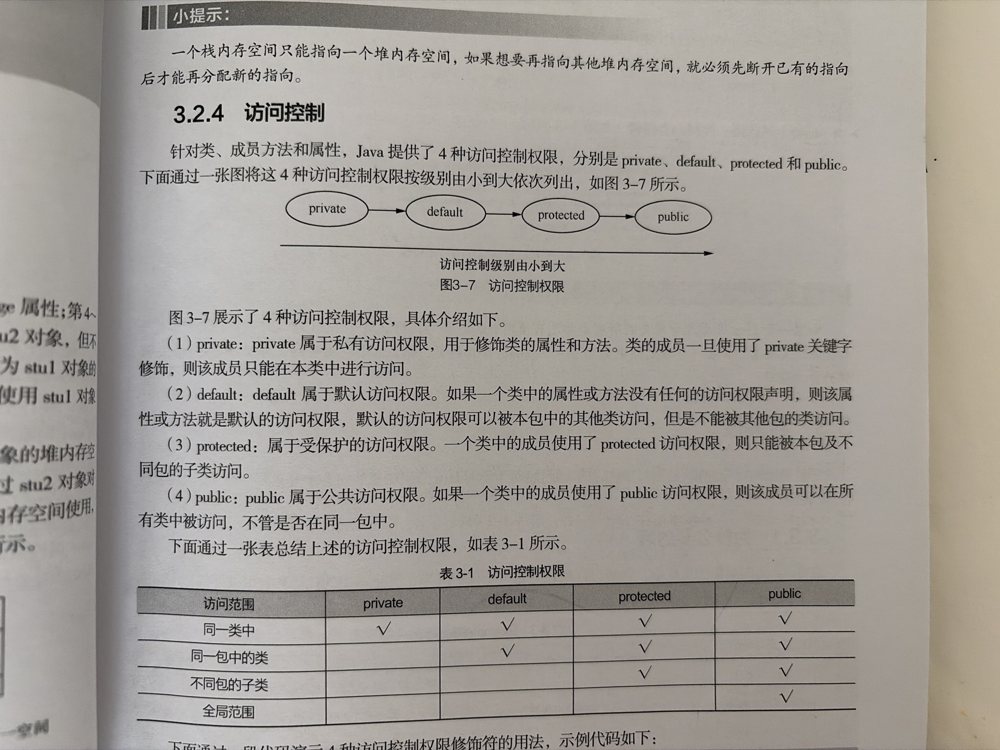
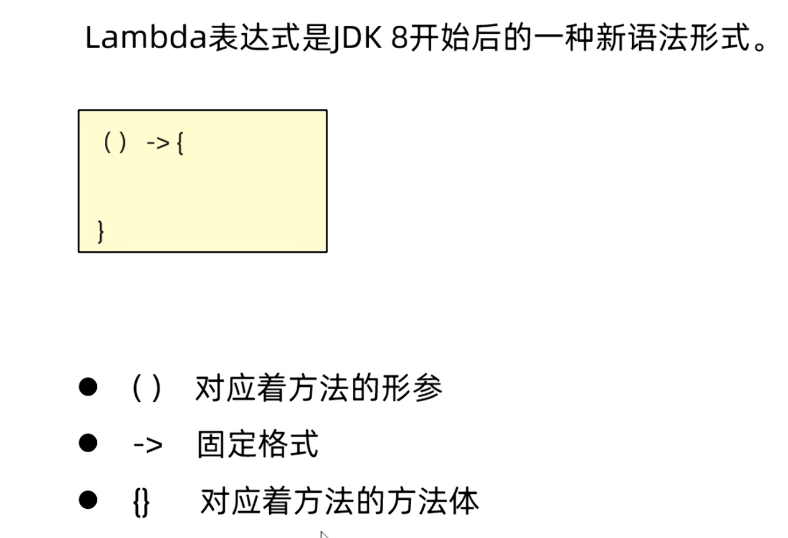
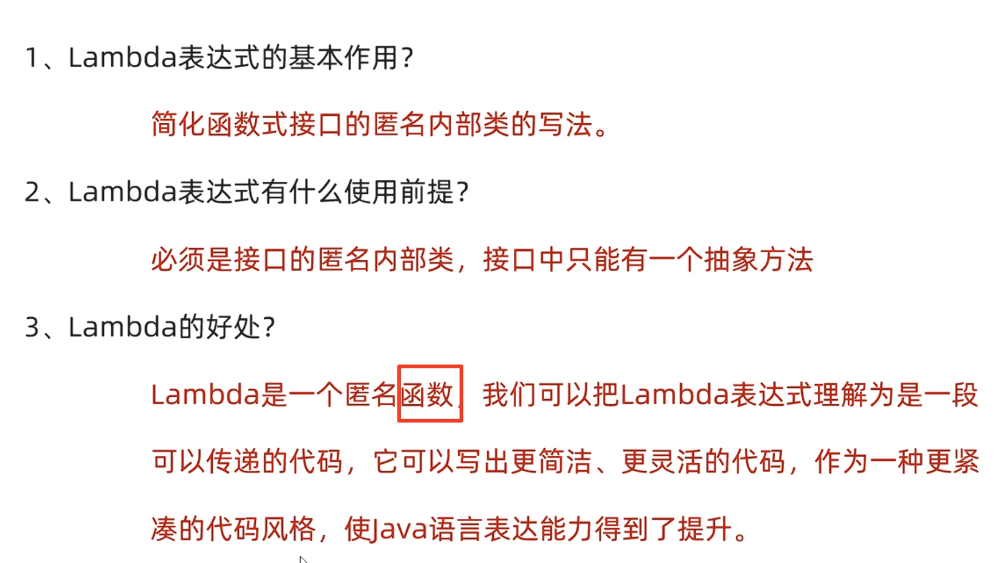
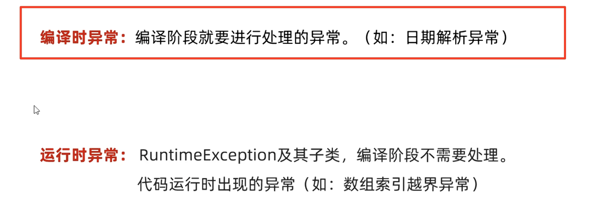
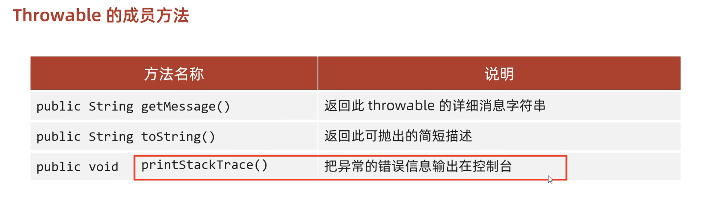
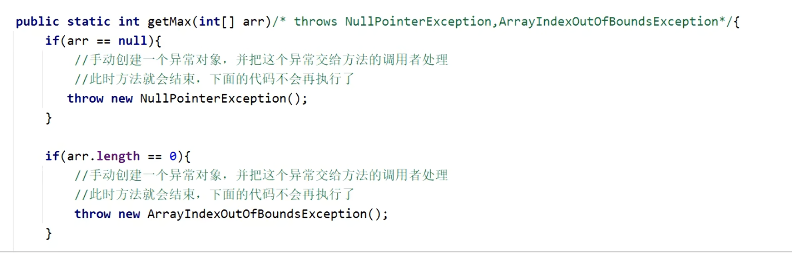
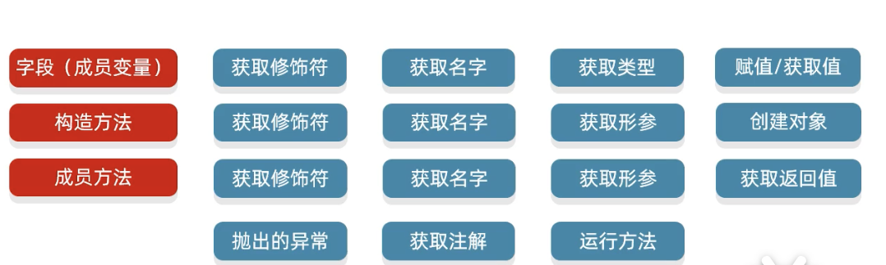

# Java复习

# **基础知识：**

## 标识符

Java标识符可以用字母数字下划线和美元符号，但是不能用数字开头。


## 方法重载、重写

重载 Overload 是指方法名一样，但是形参列表里的参数不一样，比如add方法有好几个，但是我想实现不同数据类型的加法，参数不一样。发生在**同一个类中**，多个方法拥有**相同的方法名**，但**参数列表不同**（参数个数、类型、顺序），与返回值、修饰符无关，是「编译时多态」。

重写 Override 发生在**父子类（或接口与实现类）之间**，子类定义一个与父类（或接口）**方法名、参数列表、返回值类型完全一致**（特殊情况可兼容）的方法，覆盖父类方法的实现，是「运行时多态」。


## 类成员、类方法

 一、 类成员（成员变量 / 实例变量，非静态成员变量）

类成员（通常简称「成员变量」）是定义在类中、方法体外的**非静态变量**，属于对象（实例）所有，也叫「实例变量」。

1. **定义位置与语法**
   - 定义在类内部，所有方法（包括构造方法、成员方法）外部。
   - 语法格式：`[访问修饰符] [其他修饰符] 数据类型 变量名 [= 初始化值];`
   - 示例：`public String name;`、`private int age = 18;`
2. **所属对象，而非类**
   - 成员变量属于**单个对象（实例）**，每个对象都会独立拥有一份该变量的副本，修改一个对象的成员变量不会影响其他对象。
   - 示例：创建两个`Person`对象，`person1.name = "张三"`不会改变`person2.name`的值。
3. **初始化与默认值**
   - 无需显式初始化，Java 会为其分配「默认初始值」（局部变量无此特性），默认值规则如下：
     - 基本数据类型：`byte/short/int/long`→0；`float/double`→0.0；`char`→'\u0000'（空字符）；`boolean`→false。
     - 引用数据类型（`String`、数组、自定义类等）→`null`。
   - 可显式初始化（定义时赋值），或在构造方法、初始化块中赋值。
4. **访问方式**
   - 必须先创建类的实例（对象），通过「`对象名.成员变量名`」访问。
   - 类的内部（成员方法、构造方法中），可直接通过变量名访问（隐含`this.变量名`）。
   - 静态方法中**无法直接访问**成员变量（静态方法属于类，无对象实例，无法获取对象专属的成员变量）。
   - 示例：`Person p = new Person(); p.name = "李四";`
5. **可使用的修饰符**
   - 访问修饰符：`public`、`protected`、`default`（包访问权限，不写修饰符）、`private`。
   - 其他修饰符：`final`（常量，赋值后不可修改）、`transient`（序列化忽略）、`volatile`（保证可见性，禁止指令重排）。
   - 不可使用的修饰符：`static`（加`static`即为静态变量，不属于成员变量）、`abstract`（抽象修饰符不适用变量）。
6. **作用域与生命周期**
   - 作用域：整个类内部可访问（受访问修饰符限制），外部需通过对象访问（受访问修饰符限制）。
   - 生命周期：与对象绑定，对象被创建（`new`）时分配内存，对象被垃圾回收（GC）时销毁，随对象的生命周期而变化。
7. **与局部变量的核心区别**
   - 局部变量定义在方法 / 代码块中，成员变量定义在类中、方法外。
   - 局部变量无默认值，必须显式初始化后才能使用；成员变量有默认值。
   - 局部变量属于方法 / 代码块，生命周期随方法 / 代码块执行结束而销毁；成员变量属于对象，生命周期随对象。

 二、 类方法（静态方法，`static`修饰的方法）

类方法是用`static`修饰的方法，定义在类中，属于类本身所有，而非对象（实例）所有。

1. **定义位置与语法**
   - 定义在类内部，方法体外（可与成员变量交替定义）。
   - 语法格式：`[访问修饰符] static [返回值类型] 方法名([参数列表]) [throws 异常列表] { 方法体 }`
   - 示例：`public static void showInfo() {}`、`private static int add(int a, int b) { return a+b; }`
2. **所属类，而非对象**
   - 类方法属于**类本身**，所有对象共享同一份类方法副本，无需创建对象即可调用。
   - 即使通过对象调用类方法（`对象名.类方法名()`），编译器也会自动转换为「类名。类方法名 ()」，本质还是类调用。
3. **访问限制：仅能直接访问静态成员**
   - 类方法中**可直接访问类的静态变量（类变量）和其他静态方法**（无需创建对象，同属类本身）。
   - 类方法中**无法直接访问非静态成员变量（成员变量）和非静态方法（成员方法）**（必须手动创建类的实例，通过「实例。非静态成员」访问）。
   - 原因：类方法调用时可能不存在任何对象实例，而非静态成员依赖于对象实例。
4. **访问方式**
   - 推荐方式：「`类名.类方法名()`」，直接通过类名调用，无需创建对象。
   - 不推荐方式：「`对象名.类方法名()`」，语法合法但可读性差，容易混淆为成员方法。
   - 类内部（静态方法 / 成员方法中），可直接通过方法名调用同类的静态方法（省略「类名.」）。
   - 示例：`Math.max(10, 20);`（JDK 自带静态方法）、`Person.showClassName();`
5. **可使用的修饰符**
   - 访问修饰符：`public`、`protected`、`default`、`private`。
   - 其他修饰符：`final`（无法被子类重写，仅能被隐藏）、`synchronized`（同步锁，锁的是类对象）、`native`（本地方法）。
   - 不可使用的修饰符：`abstract`（抽象方法无方法体，静态方法必须有方法体，二者冲突）、`this`/`super`（静态方法中无对象实例，无法使用`this`和`super`关键字）。
6. **作用域与生命周期**
   - 作用域：受访问修饰符限制，整个类内部可直接调用，外部可通过「类名。方法名」调用（符合访问权限）。
   - 生命周期：与类绑定，类被类加载器加载（JVM 启动 / 首次使用类时）时初始化，类被卸载（极少发生）时销毁，生命周期贯穿整个类的存在周期。
7. **核心特性与使用场景**
   - 无`this`引用：静态方法中不存在`this`关键字（`this`指向当前对象实例），也无法使用`super`关键字（指向父类对象实例）。
   - 无法被重写（Override）：子类可定义与父类同名的静态方法，这是「方法隐藏」而非「方法重写」，不具备运行时多态特性。
   - 适用场景：工具类方法（如`java.util.Arrays`、`java.lang.Math`）、无需依赖对象状态的方法、全局共享的功能方法。

 三、 补充：类成员 / 类方法与实例成员 / 实例方法的核心对比

| 对比维度   | 类成员（静态变量）/ 类方法（静态方法） | 实例成员（成员变量）/ 实例方法（成员方法）   |
| ---------- | -------------------------------------- | -------------------------------------------- |
| 所属对象   | 类本身                                 | 类的单个对象（实例）                         |
| 访问方式   | 类名.xxx（推荐）、对象名.xxx（不推荐） | 对象名.xxx、类内部隐含 this.xxx              |
| 默认值     | 类变量有默认值（同成员变量）           | 成员变量有默认值，实例方法无默认值（需实现） |
| 相互访问   | 仅能直接访问静态成员                   | 可直接访问静态成员和实例成员                 |
| 生命周期   | 随类加载而初始化，随类卸载而销毁       | 随对象创建而初始化，随对象 GC 而销毁         |
| 关键字支持 | 不支持`this`/`super`                   | 支持`this`/`super`                           |

总结

1. 类成员（实例变量）：属于对象，有默认值，随对象生命周期变化，仅能通过对象访问。
2. 类方法（静态方法）：属于类，无需对象即可调用，仅能直接访问静态成员，生命周期与类绑定。
3. 核心区分点：「所属主体」（类 vs 对象），这决定了二者的访问方式、生命周期和相互访问限制。
4. 实用原则：无需依赖对象状态的功能，优先使用静态方法 / 静态变量；需要封装对象状态的，使用实例成员 / 实例方法。

## 访问权限


private default protected public





## Lambda表达式




只能简化函数式接口的匿名内部类。

有且仅有**一个**抽象方法的接口，称为函数接口。



```java
package com.annypst;

public class lambda {
    @FunctionalInterface
    public interface swimming{
        public abstract void swim();
    }

    public static void method(swimming s){
        s.swim();
    }

    public static void main(String[] args) {
        method(
                ()->{
                    System.out.println("swimming...");
                }
        );
    }


}

```

```java
 public static void main(String[] args) {
        Integer[] arr={2,3,1,6,5,4,9,7,8,0};
        Arrays.sort(arr,(o1,o2)->o1-o2);
        System.out.println(Arrays.toString(arr));
    }
```


## 多线程

线程创建：

1.继承Thread类

```java
	class Mythd extends Thread{
    public void run()/*some code to running*/{
      System.out.println("is running!!!");
    }
  }

	psvm{
  	Mythd m1=new Mythd();
    m1.start();//open thread
    
}
```

2.实现Runnable接口

```java
package com.annypst.Threading;

public class thd {
    public static class mythd implements Runnable{
        public void run(){
            while (true)
            System.out.println("running...");
        }
    }

    public static void main(String[] args) {
        mythd m1=new mythd();
        Thread s1=new Thread(m1);//creating thread
        s1.start(); //starting thread
    }
}


```

注意第二种方法是要用Thread对象运行线程。

Thread.sleep(ms) 、synchronized(Obj Lock)同步线程方法

**线程生命周期**：

新建new 创建了这个线程对象

就绪runnable 调用了start方法

运行running 抢占到了CPU的资源

阻塞blocked 被挂起、失去了cpu资源、调用sleep方法、wait方法（使用notify唤醒）、调用另一个线程的join方法

死亡terminated 调用stop方法，或者正常运行完毕、或者抛出异常、产生错误。

## 异常处理

异常体系，最上层的父类是Exception



try catch finally

```java
package com.annypst.Exception;

public class exp1 {
    public static void main(String[] args) {
        try{
            int[] arr={1,2,3};
            System.out.println(arr[3]);
        }
        catch (Exception e){
            System.out.println("has exception "+e);
        }
        finally {
            System.out.println("over.");
        }
        }

}

```





自定义异常


## 接口

   注意：接口中的抽象方法默认会自动加上public abstract修饰程序员无需自己手写！！
       按照规范：以后接口中的抽象方法建议不要写上public abstract。因为没有必要啊，默认会加上。

 在接口中定义的成员变量默认会加上： public static final修饰。

implements


## 泛型

- 泛型的介绍

​	泛型是JDK5中引入的特性，它提供了编译时类型安全检测机制

- 泛型的好处

  1. 把运行时期的问题提前到了编译期间
  2. 避免了强制类型转换
- 泛型的定义格式

  - <类型>: 指定一种类型的格式.尖括号里面可以任意书写,一般只写一个字母.例如: <E> <T>
  - <类型1,类型2…>: 指定多种类型的格式,多种类型之间用逗号隔开.例如: <E,T> <K,V>


多态的弊端是不能调用子类的特有功能，

泛型可以在其他很多地方进行定义，比如方法、类、接口


泛型方法：使用类名后面定义的泛型 ，所有方法都可以用

在方法上声明自己的泛型，只有本方法能用

```java
package com.annypst.fanxing;

import java.util.ArrayList;
import java.util.Iterator;

public class fanxing {
    public static void main(String[] args) {
        ArrayList<Integer> list=new ArrayList<>();

        Fanlei<Integer> f1=new Fanlei<>();
        f1.add(list,1,2,3,4,5);

    }
    public static class Fanlei<e>{

        public void add(ArrayList<e> l1,e...ele){
            for(e i:ele){
                l1.add(i);
            }
            Iterator<e> it=l1.iterator();
            while(it.hasNext()){
                e st=it.next();
                System.out.println(st);
            }
            System.out.println(l1.toString());
        }
    }
}


```


## JDBC


## 数组

## 常见类


## 反射

Class类代表的是class对象

实例化class对象的方法：

```java
//获取class对象的3种方法
Class.forName("FULL class_name");//源代码阶段
类名.class;//加载到内存阶段
对象.getClass();//创建对象阶段（运行阶段）    
```



反射获取构造方法：

​	获取所有公共的：getConstructors()

​	获取所有的，包括私有的：getDeclaredConstructors()

反射获取成员变量属性：

​	获取所有公共的：getFields()

​	获取所有的，包括私有的：getDeclaredFields()

反射获取成员方法：

​	获取所有公共的：getMethods()

​	获取所有的，包括私有的：getDeclaredMethods()

反射获取接口：

​	getInterfaces()

获取权限:

​	使用getModifiers()

Object invoke （object obj, Object... args）： 运行反射获取到的方法

## GUI基础

Jframe

Jdialog：可用来创建模态非模态对话框。 

## 流的基本概念

## 匿名类、内部类

## 类和接口的定义、使用

## 数据类型分类


## this、super、static


## equals()方法


 

# **简答：**


## 多线程编程的两种实现方式

## 构造方法 成员方法 类方法


## 集合的实现类的区别

## 实现GUI事件处理的方法

## 多态性

## Jdbc 

## 反射


 

# **程序填空：**

## 多线程编程，线程冲突问题解决，比如课本案例的售票场景

## 动态多态性（子类对象上转成父类对象后体现的多态性）

## 子类对象的构建

## 匿名类、Lambda的使用

## 线程的编程方法

## 事件处理的方法


 

# **编程：**


## 1、类的定义，setter和getter方法，ArrayList<T>作为成员变量的使用、ArrayList的遍历。

## 2、字符串的基础操作、基本方法调用、处理、遍历等。

## 3、基本循环的掌握

## 4、利用Scanner类实现输出、正则表达式对字符串的基本判断

## 5、toString方法的重写


