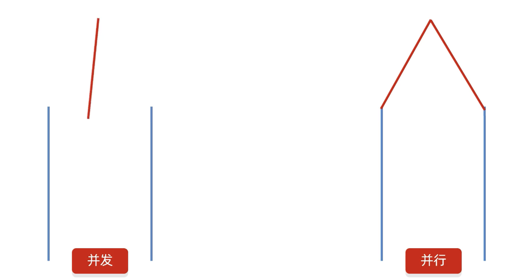
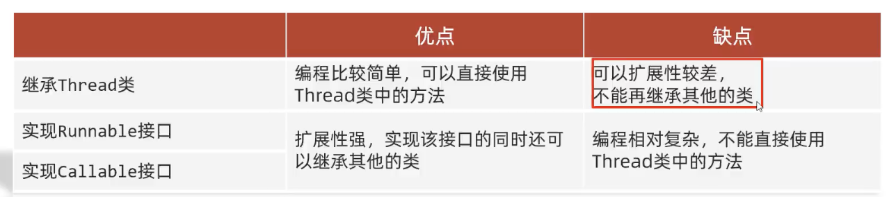

# 多线程

## 引言

线程：

是操作系统能够进行运算调度的最小单位。它被包含在进程之中，是进程中的实际运作单位。

迸程：

进程是程序的基本执行实体

简单理解：线程应用软件中互相独立，可以同时运行的功能，比如微信里聊天、视频、下载功能。

在编程中，多线程可以允许CPU在不同程序之间切换，从而提高程序的运行效率。


 


## 并发和并行

并发：在同一时刻，有多个指令在单个CPU上**交替**执行

并行：在同一时刻，有多个指令在多个CPU上同时执行



在计算机中，并发和并行是可以同时进行的。

## 多线程的实现方式

① 继承Thread类的方式进行实现

② 实现Runnable接口的方式进行实现

③ 利用Callable接口和Future接口方式实现


① 继承Thread类的方式进行实现：

```java
package com.annypst.Threading;

public class Thread1 extends Thread{
    @Override
    public void run(){
        for (int i = 0; i < 10; i++) {
            System.out.println("我是线程"+getName());
        }
    }
}

```

测试类：

```java
package com.annypst.Threading;

public class ThreadTest {
   /* 多线程的第一种启动方式：
    * 1. 自己定义一个类继承Thread
    * 2. 重写run方法，run里面写需要执行的代码
    * 3.创建子类的对象，并启动线程 */
    public static void main(String[] args) {
        Thread1 t1=new Thread1();
        Thread1 t2=new Thread1();
        t1.setName("1");//设置线程名
        t2.setName("2");//设置线程名
        t1.start();//启动线程
        t2.start();//启动线程
    }
}

```

结果：

`我是线程1
我是线程2
我是线程2
我是线程2
我是线程2
我是线程2
我是线程2
我是线程1
我是线程1
我是线程1
我是线程2
我是线程2
我是线程2
我是线程2
我是线程1
我是线程1
我是线程1
我是线程1
我是线程1
我是线程1`

可以发现两个线程是交替随机执行的。


② 实现Runnable接口的方式进行实现：

```java
package com.annypst.Threading.M2;

public class Thread2 implements  Runnable {
    @Override
    public  void run(){
        Thread tName=Thread.currentThread();//获取当前线程,并将其赋值给tName,tName就是当前线程,可以用getName()方法获取线程名
        for (int i = 0; i < 10; i++) {
            System.out.println("我是线程"+tName.getName());
        }

    }
}

```

测试类：

```java
package com.annypst.Threading.M2;
public class ThreadTest {
    /*多线程的第二种启动方式：
     * 1.自己定义一个类实现Runnable按口
     * 2.重写里面的run方法
     * 3.创建自己的类的对象
     * 4.创建一个Thread类的对象，并开启线程*/
    public static void main(String[] args) {
        Thread2 t1 = new Thread2();//创建自己的类的对象
        Thread run1 = new Thread(t1);//创建一个Thread类的对象,执行自己的类的run方法
        Thread run2 = new Thread(t1);//创建一个Thread类的对象，执行自己的类的run方法
        run1.setName("1");//设置线程的名字
        run2.setName("2");//设置线程的名字
        run1.start();//开启线程
        run2.start();//开启线程
    }


}

```

结果：

`我是线程2
我是线程1
我是线程1
我是线程2
我是线程2
我是线程2
我是线程2
我是线程2
我是线程2
我是线程2
我是线程2
我是线程2
我是线程1
我是线程1
我是线程1
我是线程1
我是线程1
我是线程1
我是线程1
我是线程1`


③ 利用Callable接口和Future接口方式实现:

```java
package com.annypst.Threading.M3;

import java.util.concurrent.Callable;

public class Thread3 implements Callable<Integer> {//此处的泛型是返回值类型，可以根据需要修改
    @Override
    public Integer call(){//此处的call()方法是线程执行的方法,有返回值
        int sum=0;
        for (int i = 0; i < 100; i++) {
            sum+=i;
        }
        return sum;
    }
}

```

测试类：

```java
package com.annypst.Threading.M3;
import java.lang.Thread;
import java.util.concurrent.ExecutionException;
import java.util.concurrent.FutureTask;
public class ThreadTest {
    /*
*
* 多线程的第三种实现方式：
特点：可以获取到多线程运行的结果
*1. 创建一个类MyCallable实现Callable接口
2. 重写cal1（是有返回值的，表示多线程运行的结果）
*
3. 创建MyCallable的对象（表示多线程要执行的任务）
4. 创建FutureTask的对象（作用管理多线程运行的结果）
5. 创建Thread类的对象，并启动（表示线程）
**/

    public static void main(String[] args) throws ExecutionException, InterruptedException {
        Thread3 t3=new Thread3();//创建Thread3对象
        FutureTask<Integer> f1=new FutureTask<>(t3);//创建FutureTask对象,传入MyCallable对象
        Thread run=new Thread(f1);//创建Thread对象，并传入FutureTask对象
        run.start();//启动线程
        System.out.println(f1.get());//获取多线程运行的结果
    }

}

```





## 多线程中常见的成员方法


我们这里取其中的几个示例。

### 优先级

计算机中的现成调度分为抢占式调度和非抢占式调度，Java中采用的是抢占式调度（随机）。

Java中优先级分为10个等级，最低是1最高是10。

优先级越高，抢占到CPU的概率越高。


