# 第一章 计算机系统概述

Keywords： 抽象分层思想

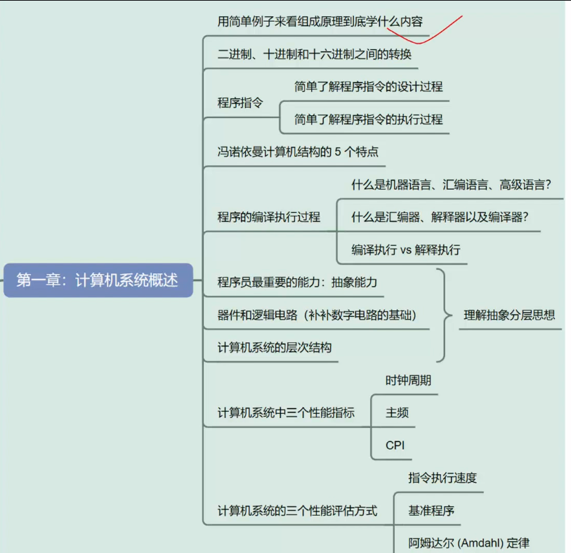

## 1.1 引入

反编译 objdump 指令

para：

-d, --disassemble        # 反汇编包含代码的节区
-D, --disassemble-all    # 反汇编所有节区
-S, --source             # 混合显示源代码和汇编代码（需要编译时使用-g选项）
--prefix-addresses       # 在反汇编时显示完整地址
--no-addresses           # 不显示地址信息

所有的程序经过编译后均会形成**指令序列**和**数据** ！

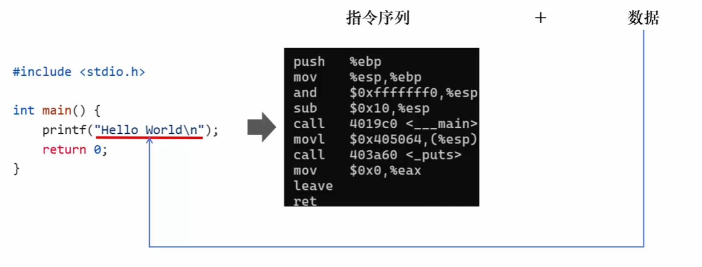

> [!NOTE]
>
> 计算机执行一个程序的过程：
>
>  键盘控制器先存储字符串，再将此字符串通过总线读入主存储器，CPU再通过总线将此字符串存入寄存器组，程序得以执行。

## 1.2进制转换

 

需要熟悉二进制，十进制和16进制之间的转换，由于内容较为基础，所以略过。

ASCII码 

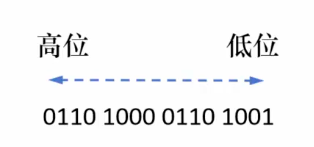

需要注意的是。 16进制转换为二进制比较方便，只需要将16进制数的每一位展开为其对应的二进制数码即可。

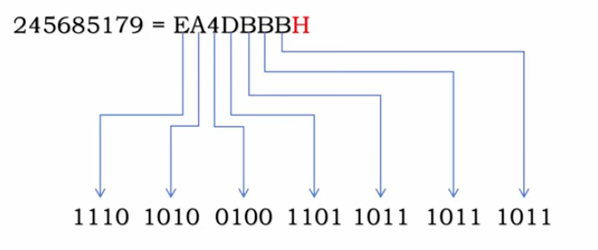

## 1.3指令的设计过程 第五章将会详细讲解

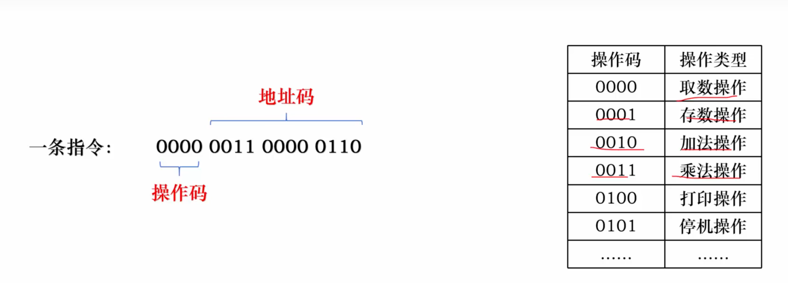

源地址码和目标地址码

 

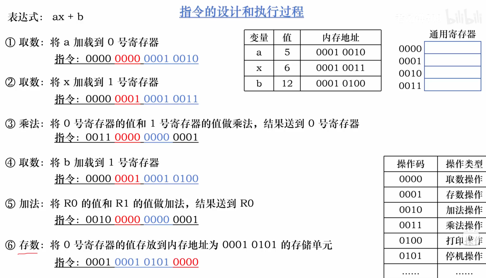

## 1.4指令的执行过程

三种总线： 地址总线 控制总线 数据总线

两种寄存器组： 

通用GPRs   

专用：程序计数器PC  指令寄存器IR   内存地址寄存器MAR     内存数据寄存器MDR     算术逻辑单元ALU  控制单元CU 

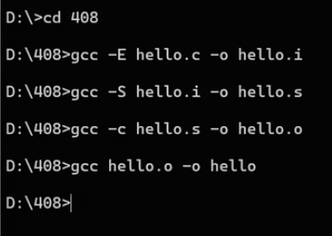

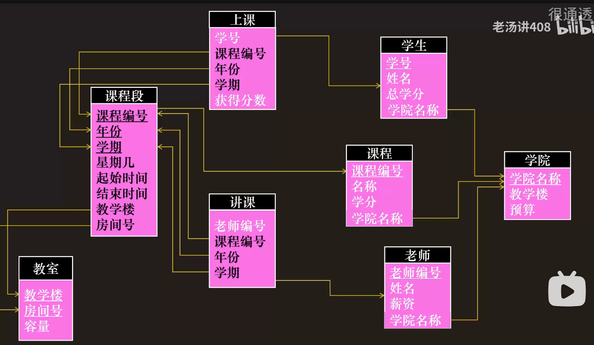

## 1.8器件和逻辑电路

NMOS 施加电压时导通

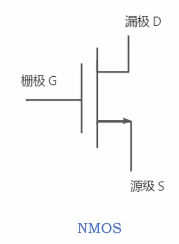

PMOS 不施加电压时导通 PNP

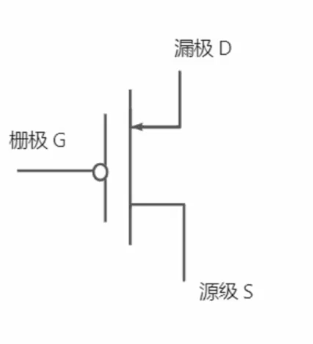

 非门

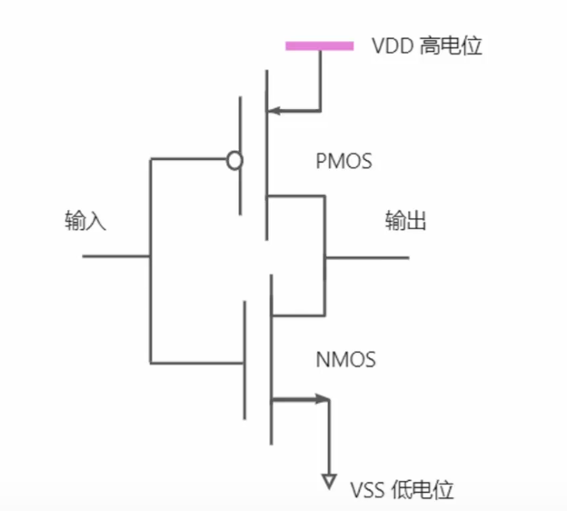

或门

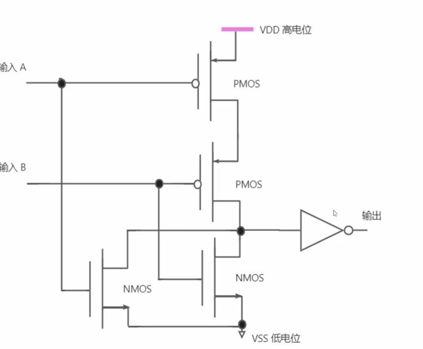

与门

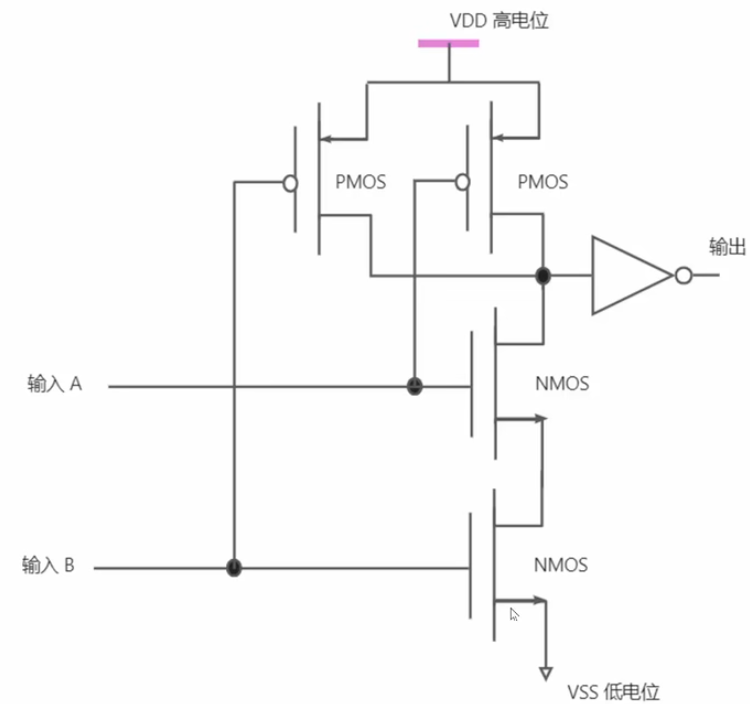

XOR

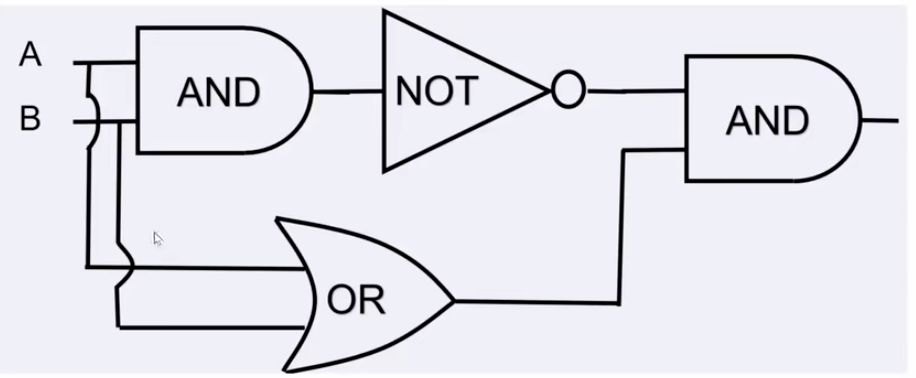

## 1.9 Computer system abstract structure

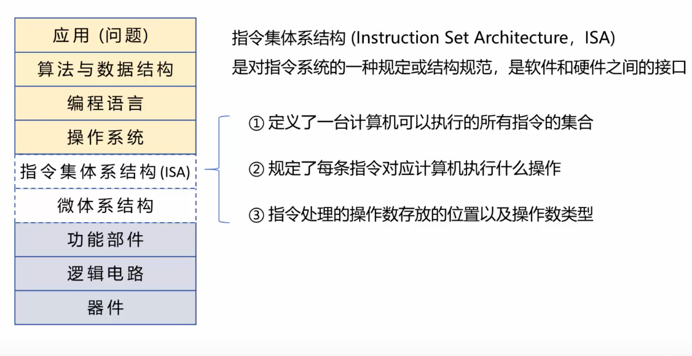

而微体系结构即为ISA的具体实现细节，专注于处理器内部硬件的实现细节。如加法器如何实现进位等。相同的指令集可能会有不同的微体系结构。

 

 ## 1.10  3 Standard of computer

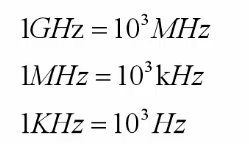

CPI 

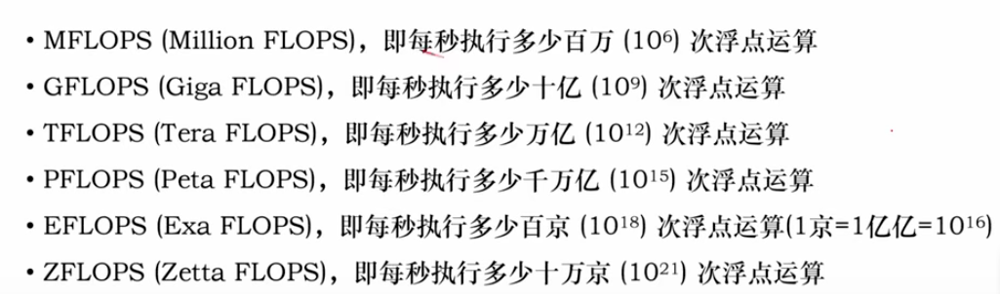

进率为1000.

Amdahl Theory 

对系统中某个硬件部分或者软件中的某部分进行更新所带来的系统性能的改进程度，取决于该硬件部分或软件部分被使用的频率，或其执行时间占总执行时间的比例。

 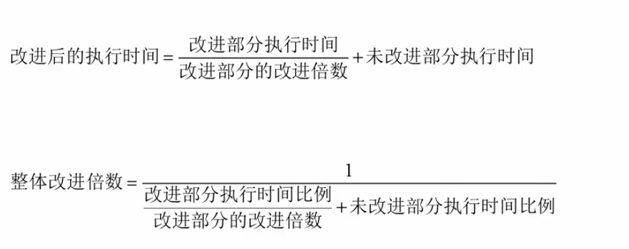

