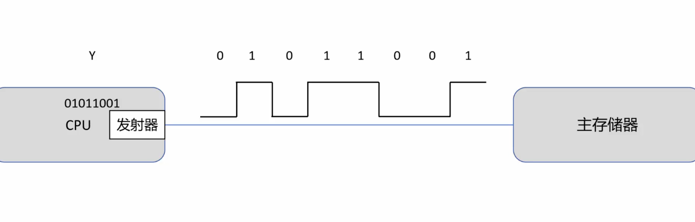
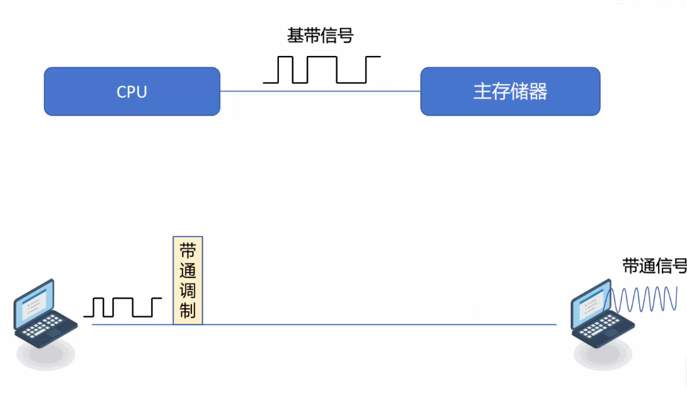
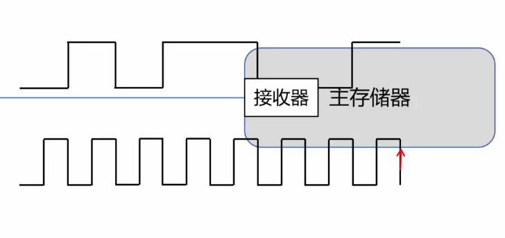
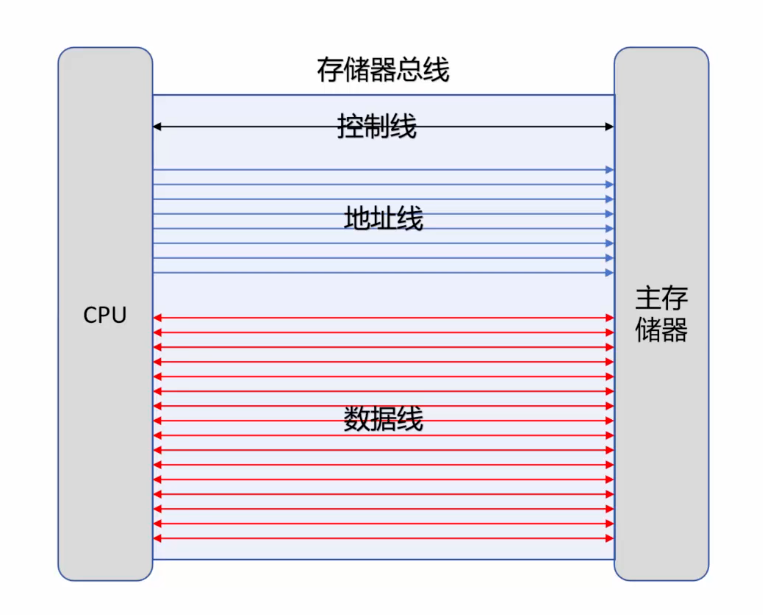
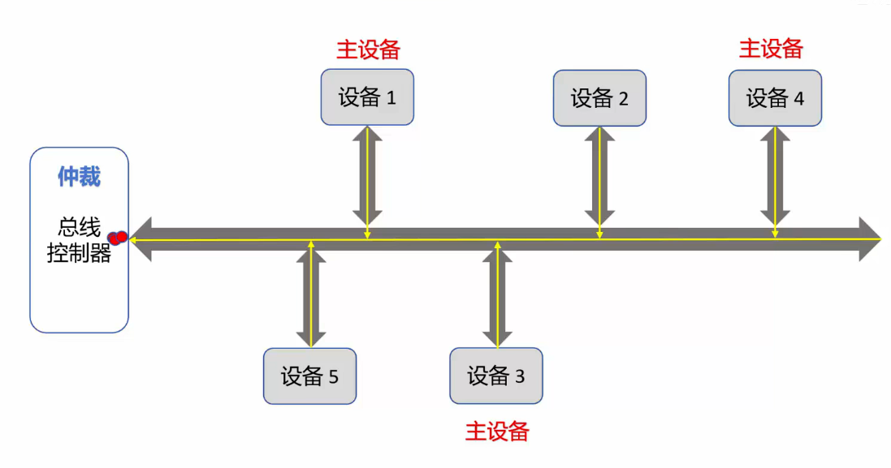
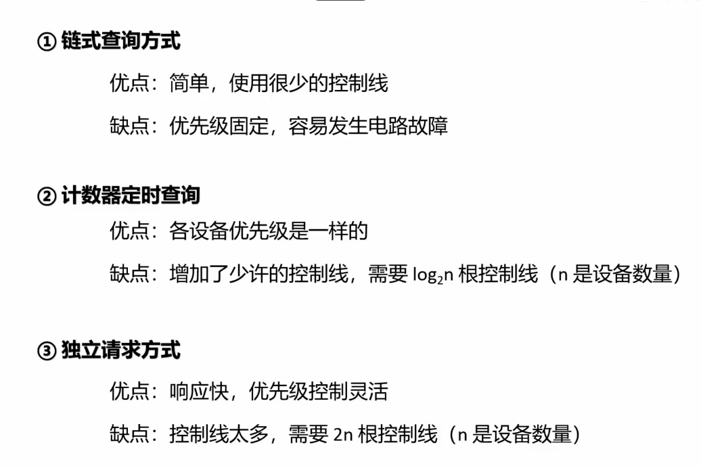

# 第二章 总线

 ## 2.2简单通信基础知识

 利用电信号传输数据

连续数据-----模拟信号、

离散数据------数字信号（计算机中）

单位时间1s内可以传输的脉冲信号的个数称为传输频率

单位是赫兹

- 发射器与接收器之间的信号同步问题：发射器同时发送时序信号和数据，这样接收器就可以知到时序开始和时序结束的时刻了。这叫做**外同步法**，计算机内部一般采用这种方法。

- 但是外同步法需要占用额外的传输资源，所以使用**自同步法**，即利用曼彻斯特编码。将时序信号直接嵌入传输的数据当中，就可以实现自同步。

总线宽度，串行与并行：

   ## 2.4总线仲裁

 总线控制器决定谁才能使用总线的过程。

 

