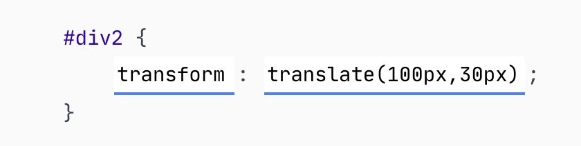
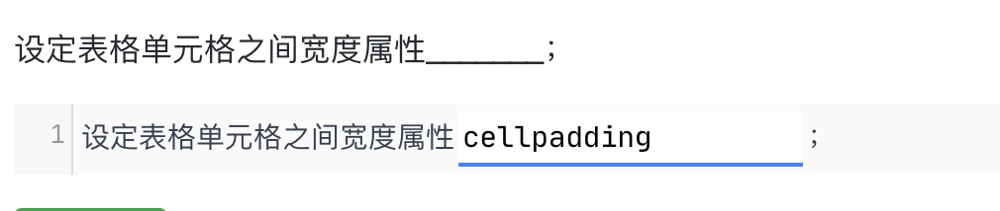
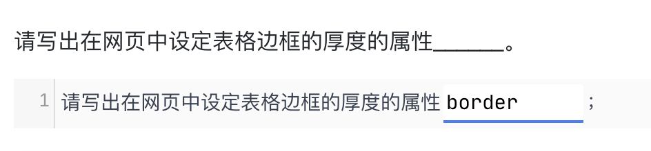
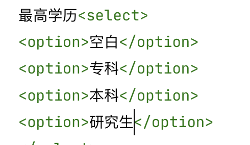
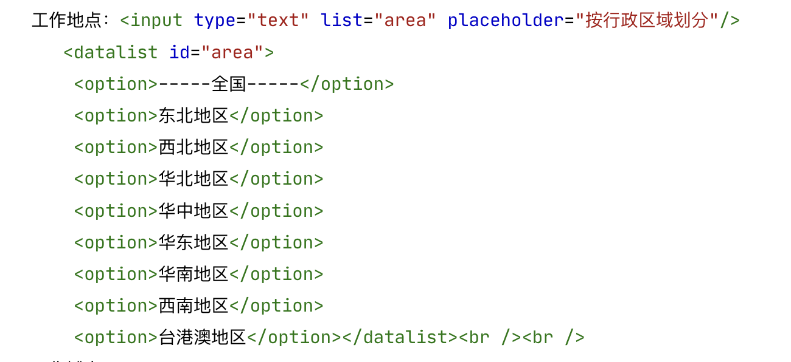
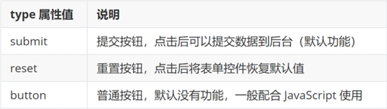
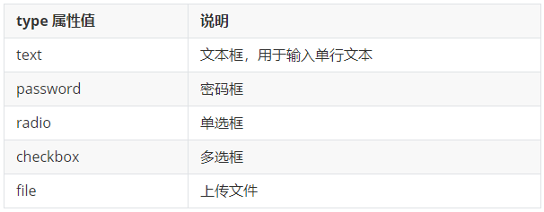

# 常用标签总结

## CSS

> [!CAUTION]
>
> 什么和什么 选择器是逗号
>
> 什么中的什么 选择器是空格

两列布局（列宽300px，列之间间隙50px，列之间边框（1px dashed #1caa0d）

地址自动换行word-wrap: break-word;

repeating-linear-gradient重复渐变

背景图像定位（相对于边框定位）、背景图像裁剪（从内边距区域向外裁剪）。background-origin:border-box; 、content-box	    =background-clip:padding-box;    

背景是否固定（固定位置）、背景位置（水平居中、垂直90%）background-attachment: fixed;    background-position: center 90%; 

用省略标记“…”标示被修剪文本。text-overflow:ellipsis;       

text-shadow: 文本阴影

letter-spacing:1px;文本的字符间距（1px）

type 属性为`submit`的`<input>`元素input[type="submit"]

text-shadow: 水平偏移 垂直偏移 模糊半径 颜色;

将一个外部样式表链接到HTML中\<link href="https://alphaspaces.pek3b.qcstor.com/1/4-3.css" type="text/css" rel="stylesheet">

 text-indent:2em;  /*首行缩进2个字符 */

字体粗细（bolder）font-weight:bolder

文本阴影（0 1px 0 black）text-shadow:0 1px 0 black;

背景线性渐变（兼容谷歌和Safari浏览器，从下到上，从#474d54到#2f363d）	background: -webkit-linear-gradient(top,#474d54,#2f363d);

- 位置（绝对定位，距离底部40px，距离左侧0px）position: absolute;
  				bottom: 40px;
        				left: 0;

不透明级别（0.6）opacity: 0.6;

text-decoration:none 无下划线 line-through删除线  blink闪烁

vertical-align: middle 垂直居中对齐/\*设置文本垂直居中\*/

列表样式 无list-style:none;

前面那个小点点的形状 list-style-type:disc: 实心圆点（默认值）**circle**: 空心圆点。**square**: 实心方块。

行高 line-height:

过渡属性transition: width 0.3s ease-in-out; 

> [!IMPORTANT]
>
> [type="radio"],
> 		[type="checkbox"] 是选择html中特定属性的，比如这个就是Input标签，不同属性的。

border-radius:圆弧边框

文本对齐方式  text-align:  center

box-shadow:属性值：X 轴偏移量  Y 轴偏移量  模糊半径  扩散半径  颜色  内外阴影inset

字体加粗（700）font-weight:700;

html标题居中对齐：  \<h1 align="center">

添加一个有序列表，类型为数字，编号从数字 1 开始 : \<ol type="1" start="1">

字符间距（5px）letter-spacing:5px

dl  dd dotted

字体加粗显示:font-weight:bold;(normal)

内容水平居中    text-align:center;

合并边框： border-collapse: collapse;设置表格框线合并

当元素内的内容溢出的时候隐藏溢出的部分。CSS1 29 overflow: hidden;

字体样式（斜体italic）font-style: italic;

段落元素：首行缩进32px  text-indent: 32px;

背景图片不重复：background:  no-repeat

光标呈现为指示链接的指针（一只手）cursor: pointer;

相对定位  position: relative;

背景-线性渐变（从左到右，渐变颜色依次为 #ff0000、#ffff00、#00ff00、#00ffff、#0000ff、#ff00ff）background: linear-gradient(to right,#ff0000,#ffff00,#00ff00,#00ffff,#0000ff,#ff00ff);

边框（颜色为#FF00FF的1px虚线） border: 1px dashed #FF00FF;

背景图像的起始位置（中部）、背景图像的大小（覆盖背景区域）

 background-position: center;  background-size: cover;

背景图片不重复 background-repeat: no-repeat;


`transform`是 CSS 的变形属性，用于对元素进行平移、旋转、缩放等变换；

`translate(100px, 30px)`是`transform`的子属性，代表**水平 + 垂直方向的平移**

clear

块状元素





## html

北京项目下嵌套一个`有序列表`，编号类型为`大写字母` \<ol type="A">

在上海项目下嵌套一个`有序列表`，编号类型为`数字`，起始值为`6`，`降序\<ol type="1" start="6" reversed="reversed">

定义一个`表格标签`，表格样式为：`宽度（400）、边框宽度（3）、表格边框显示状态（只显示表格的上下边框）、单元格内容与边界之间距离（5）、单元格之间的间距（2）` \<table width="400" border="3" frame="hsides" cellpadding="5" cellspacing="2">

百度网logo图片样式设置：`宽度（270px）、边框宽度（1px）、右对齐、垂直间距（10px）、水平间距（20px）`；	\

`<p><strong>粗体</strong>的文字效果</p>

`		<p><em>这是斜体的文字</em></p>

		<p><del>删除这行文本</del></p>
		<p><ins>下划线文本</ins></p>`	``

pattern 正则匹配属性

第一个文本框：名称（username）、文本框宽度（20）、最大字符数（18）；\<input name="username" type="text" size="20" maxlength="18" />

表单边框	\<fieldset> \<legend>

face="隶书" 设置字体

预格式化的文本 pre

- 第 2 对`li`标签，设置类选择器`pt`，标签内添加 1 对`span`标签，`span`标签内容为：`昵称：`，继续在`li`标签内添加`input`输出框，`type`为`text`，输入框为必填、且只能是 6 到 10 位大写字母或小写字母或数字

multiple属性:ctrl 多选

\<li class="pt"><span>昵称：</span>\<input type="text" required="required" pattern="[a-zA-Z0-9]{6,10}">\</li>

添加文本域：名称（textfield）、行数（5）、每行字符数50 \<textarea name="textfield" cols="50" rows="5" >

 居中对齐\<h3 align="center">个人信息\</h3>

单选框默认选中\<input type="radio" name="sex" checked="checked">

> [!NOTE]
>
> 其他为selected

下拉列表




- 第 6 对`li`标签，设置类选择器`pt`，标签内添加 1 对`span`标签，`span`标签内容为：`年龄：`，继续在`li`标签内添加`input`输出框，`type`为`number`，输入框为必填，内容数值范围为0-120。

\<li class="pt"><span>年龄:</span>\<input type="number" required="required" min="0" max="120">\</li>

- textarea
- > [!WARNING]
  >
  > 注意查看css1 22题，选择器

使用`input`元素添加文本框\<input type="text">

使用`input`元素添加复选框  \<input type="checkbox" >

联系邮箱是一个邮箱输入框，禁用自动完成功能，必填项。\\\<input type="email" required="required" autocomplete="off">  

\<strong>\</strong>

在该区域中添加一个提交按钮，`id`为`sub`\<button id="sub" type="submit">


工作地点是一个单行文本输入框，提供一个`id`为`area`的选项列表，提示信息是`按行政区域划分`，其中选项分别是：`-----全国-----`、`东北地区`、`西北地区`、`华北地区`、`华中地区`、`华东地区`、`华南地区`、`西南地区`、`台港澳地区`。




> [!WARNING]
>
> 注意按钮有type的！！！submit reset

  margin-bottom:

type 属性为submit的<input>元素，使用什么选择器？

```css
input[type="submit"]
```

font-weight: bold; （700）

border-collapse:collapse


## JS


 [HTML 上标标签 ]sup


### 按钮

```html
<button type="">按钮</button>
```



### input 标签

input 标签 type 属性值不同，则功能不同。 

```html
<input type="..." >
```



经验：用 label 标签绑定文字和表单控件的关系，增大表单控件的点击范围。 

checked默认 选中


\<input type="text" name="user_name" value="myemail@163.com" disabled readonly>

1. **`disabled`**：「禁用属性」（布尔属性，无需赋值），设置后输入框**不可编辑、不可聚焦、不可提交**（表单提交时，该输入框的 `name` 和 `value` 不会被传递到后端），且输入框会呈现灰色置灰样式。
2. **`readonly`**：「只读属性」（布尔属性，无需赋值），设置后输入框**不可编辑，但可聚焦、可提交**（表单提交时，会正常传递 `name` 和 `value` 数据），输入框样式保持正常，仅无法修改内容。

### 补充：`disabled` vs `readonly` 核心区别

- 可提交性：`readonly` 可提交，`disabled` 不可提交；
- 可聚焦性：`readonly` 可聚焦（如选中复制内容），`disabled` 不可聚焦。

CSS1 11题 input重点

 display: inline-block; 以内联块级元素的方式显示


## 一、 定位相关（`position` + 偏移属性）

1. `position`（定位方式）常用值
   - `static`：默认值，无定位，元素遵循正常文档流，**不支持偏移属性**（top/right 等无效）。
   - `relative`：相对定位，相对于自身原始位置定位，不脱离文档流，支持偏移属性。
   - `absolute`：绝对定位，相对于最近已定位（非 static）父元素定位，脱离文档流，支持偏移属性。
   - `fixed`：固定定位，相对于浏览器视口定位，脱离文档流，滚动页面时位置不变，支持偏移属性。
   - `sticky`：粘性定位，兼具`relative`和`fixed`特性，滚动到指定位置后固定，支持偏移属性。
2. 偏移属性（`top`/`right`/`bottom`/`left`）常用值
   - 像素值：`top: 10px;`、`left: 20px;`（精准偏移，最常用）。
   - 百分比：`top: 50%;`、`left: 50%;`（相对于父元素对应尺寸偏移，常用于居中）。
   - 其他：`top: auto;`（默认值，自动调整位置）。

## 二、 透明度（`opacity`）常用值

- 数值（0 ~ 1）：`opacity: 0;`（完全透明）、`opacity: 0.5;`（半透明，最常用）、`opacity: 1;`（完全不透明，默认值）。
- 补充：无其他常用值，数值精确到小数点后 1~2 位即可满足大部分场景。

## 三、 堆叠顺序（`z-index`）常用值

- 整数（正 / 负 / 0）：`z-index: 0;`（默认值）、`z-index: 99;`（普通层级提升）、`z-index: 999;`（高优先级层级，常用作遮罩、弹窗）、`z-index: -1;`（层级下沉，置于普通元素下方）。
- 补充：需配合`position`（非`static`）使用才生效，数值越大堆叠层级越高（同层级下，后渲染的元素也会覆盖先渲染的）。

## 四、 元素显示 / 布局（`display`）常用值

1. 基础显示类型：`display: none;`（隐藏元素，脱离文档流）、`display: inline;`（内联元素，不独占一行，不可设宽高）、`display: block;`（块级元素，独占一行，可设宽高）、`display: inline-block;`（内联块，不独占一行，可设宽高）。
2. 现代布局类型：`display: flex;`（弹性布局，父元素开启，子元素弹性排列）、`display: grid;`（网格布局，二维栅格排列）。
3. 补充内联布局：`display: inline-flex;`（内联弹性布局）、`display: inline-grid;`（内联网格布局）。

## 五、 额外补充（字体加粗`font-weight`，你此前关注过）

- 常用值：`font-weight: normal;`（正常字体，等价 400，默认值）、`font-weight: bold;`（加粗，等价 700，最常用）、`font-weight: 700;`（数值写法，与 bold 等效）、`font-weight: 900;`（特粗，部分字体支持）。


## 六 text-align

1. **`text-align: left;`**
   - 默认值（大部分元素），文本左对齐，符合日常阅读习惯（如段落、输入框文本）。
2. **`text-align: center;`**
   - 文本水平居中对齐，常用于标题、按钮文本、居中展示的内容块。
3. **`text-align: right;`**
   - 文本右对齐，常用于表单右侧提示、财务数据（金额）、页面右上角内容。
4. **`text-align: justify;`**
   - 文本两端对齐（首尾行除外），会自动调整单词 / 字符之间的间距，使文本左右两侧都紧贴容器边缘，常用于报刊、书籍等大段正文排版，提升整洁度。

### 补充说明

- 该属性作用于**块级元素**（如`div`、`p`、`h1`），控制其内部文本 / 内联元素的水平对齐；
- 对纯内联元素（如`span`）本身无效，需给其块级父元素设置`text-align`。


外边距（0px，水平居中）使用 `margin: 0 auto;`，直接实现「上下外边距为 0，左右外边距自动分配（水平居中）」


 background-image: url(https://alphaspaces.pek3b.qcstor.com/1%2Fheader.jpg)


## 错的客观题

css3 >14 18 19 20 21 28 37 36 34 44* 

css1>21

ht1>10 27 30 33

ht2>27 28 31 32 42 49

ht3>4 5 7 8  17 20 22 27

ht4>9 11 13 16 27 38

css4>8 9 11 12 22 28 30 44

css5>5 22 35 37 38 39 40 41 45 48

js1>21 36 45 46 22

js2>3

js3>1 2 3


​				

  