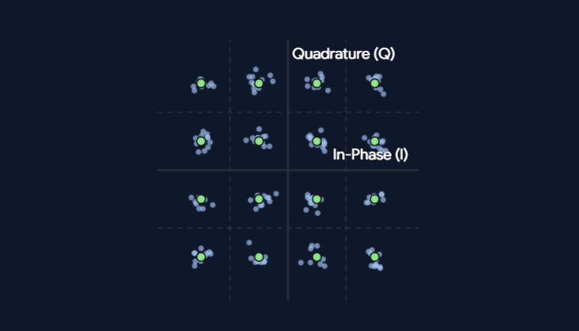

**QAM（Quadrature Amplitude Modulation，正交振幅调制）** 是一种结合了振幅调制（ASK）**与**相位调制（PSK）的数字调制技术。它通过同时改变载波的振幅与相位，使单个调制符号（Symbol）能够携带多个二进制比特。

## **为什么需要 QAM？**

在物理层传输中，奈奎斯特准则指出无噪声信道的极限波特率（符号速率）受限于带宽 $B$：

$$R_{\text{Baud}} \le 2B$$

由于信道带宽有物理上限，单靠提高波特率无法无限提升比特率。要提升数据传输速率（bit/s），必须让每个传输的符号承载更多比特（$k = \log_2 M$）：

- **单一 PSK 的缺陷**：在 16-PSK 中，所有 16 个状态点均匀分布在同一个圆周上，相邻符号的相位差仅为 $22.5^\circ$。信道中的相位抖动极易引发误码。
- **单一 ASK 的缺陷**：若采用 16-ASK，则需要 16 个不同的电压等级。动态范围大幅受限，且高电平功率消耗巨大，抗噪声能力较差。
- **QAM 的解法**：将状态点分散到由振幅和相位共同构成的二维网格中，在相同平均发射功率的前提下，有效拉大了相邻符号点之间的欧几里得距离。

**数学本质：两路正交载波叠加**

QAM 的核心在于利用了两路频率相同、相位相差 $90^\circ$（即正交）的载波。发送信号的时域表达式为：

$$s(t) = I_k \cos(2\pi f_c t) - Q_k \sin(2\pi f_c t)$$

- **$I_k$（In-phase，同相分量）**：调制余弦载波的离散电平。
- **$Q_k$（Quadrature，正交分量）**：调制正弦载波的离散电平。

由于三角函数的正交性：

$$\int_0^T \cos(2\pi f_c t) \sin(2\pi f_c t) \, dt = 0$$

接收端通过**相干解调**，将接收到的信号分别与本地生成的 $\cos(2\pi f_c t)$ 和 $-\sin(2\pi f_c t)$ 相乘，再通过低通滤波器（LPF），即可在频域无串扰地分别提取出 $I_k$ 与 $Q_k$。

**星座图与状态映射**

在二维平面上分析 QAM 时，横轴为 $I$ 分量，纵轴为 $Q$ 分量，这一几何表示即为**星座图（Constellation Diagram）**。

- 坐标点 $(I_k, Q_k)$ 对应一个特定的调制符号。
- 符号的振幅为 $A = \sqrt{I_k^2 + Q_k^2}$，相位为 $\phi = \arctan(Q_k / I_k)$。
- **16-QAM**：$I$ 和 $Q$ 各取 4 个电平（例如 $\{-3, -1, 1, 3\}$），共有 $4 \times 4 = 16$ 个状态点，每个符号携带 $\log_2 16 = 4$ 比特信息。
- **64-QAM / 256-QAM**：分别携带 6 比特与 8 比特信息。

**核心工程权衡**

| **指标**              | **低阶 QAM（如 16-QAM）**  | **高阶 QAM（如 256-QAM / 1024-QAM）**         |
| --------------------- | -------------------------- | --------------------------------------------- |
| **频带利用率**        | 较低（4 bit/symbol）       | 极高（8~10 bit/symbol）                       |
| **星座点间距**        | 间距大，容错余量足         | 间距极密，稍有噪声偏移即越界                  |
| **信噪比（SNR）需求** | 低，适合信道条件恶劣的环境 | 极高，需优质低噪信道（如近距离 Wi-Fi 7 / 5G） |

在 QAM 星座图中，任何一个点的位置都是通过直角坐标系到极坐标系的几何映射，来反映该调制状态所对应的载波振幅与相位的。

## **星座图的基本读图逻辑**

星座图的横轴为**同相分量 $I$**，纵轴为**正交分量 $Q$**，坐标原点 $(0, 0)$ 位于正中心：

- **振幅（Amplitude）**：为坐标原点到该星座点的**欧几里得距离（向量的模长）**：

  $$A = \sqrt{I^2 + Q^2}$$

  几何上，**落在以原点为中心的同一个同心圆上的点，振幅完全相同**。

- **相位（Phase）**：为原点到该点的连线与正向横轴（$I$ 轴）夹角的**极角**：

  $$\theta = \arctan\left(\frac{Q}{I}\right)$$

  几何上，**落在从原点射出的同一条射线上的点，相位完全相同**。

- **图中的噪点簇**：中间绿色的实心圆是理想的调制状态点；环绕在四周的浅色弥散小点，是加入高斯白噪声后接收端实际解调出来的采样样本点（当前界面中设置的 SNR 为 22 dB）。

**单象限 4 个符号点的具体计算**

以第一象限（右上角）为例。标准的矩形 16-QAM 在两个正半轴上各取两个对称电平，通常记为坐标值 $\{1, 3\}$。第一象限内包含以下 4 个符号点：

- **点 1 $(1, 1)$**：
  - 振幅：$A_1 = \sqrt{1^2 + 1^2} = \sqrt{2} \approx 1.414$
  - 相位：$\theta_1 = \arctan\left(\frac{1}{1}\right) = 45^\circ$
- **点 2 $(3, 1)$**：
  - 振幅：$A_2 = \sqrt{3^2 + 1^2} = \sqrt{10} \approx 3.162$
  - 相位：$\theta_2 = \arctan\left(\frac{1}{3}\right) \approx 18.43^\circ$
- **点 3 $(1, 3)$**：
  - 振幅：$A_3 = \sqrt{1^2 + 3^2} = \sqrt{10} \approx 3.162$
  - 相位：$\theta_3 = \arctan\left(\frac{3}{1}\right) \approx 71.57^\circ$
- **点 4 $(3, 3)$**：
  - 振幅：$A_4 = \sqrt{3^2 + 3^2} = \sqrt{18} = 3\sqrt{2} \approx 4.243$
  - 相位：$\theta_4 = \arctan\left(\frac{3}{3}\right) = 45^\circ$

**统计与结论辨析**

基于上述计算结果进行归并：

- **振幅种类**：共有 **3 种**（$\sqrt{2}$、$\sqrt{10}$、$3\sqrt{2}$）。其中点 $(3, 1)$ 与点 $(1, 3)$ 到原点距离相等，共享中间大小的同心圆。
- **相位种类**：共有 **3 种**（$18.43^\circ$、$45^\circ$、$71.57^\circ$）。其中内角点 $(1, 1)$ 与外角点 $(3, 3)$ 落在同一直角对角线（$45^\circ$ 射线）上，共享相同相位。

因此，“每个象限有 3 个相位、2 个振幅”的判断是**不正确的**。容易产生“2 个振幅”的误解，是因为单独看 $I$ 轴或 $Q$ 轴时各只有 2 种电平幅度（1 和 3），但合成后的载波幅度是二维模长，实际产生了 **3 种振幅**。

将这一规律推广到**整张 16-QAM 星座图**（全图 16 个点）：

- **全局振幅总数**：依然只有 **3 种**（对应全图同心的 3 个圆环）。
- **全局相位总数**：每个象限各有 3 种互不重叠的相位，四个象限合计共有 $3 \times 4 = \mathbf{12}$ **种相位**。

在星座图的 2D 平面中，**功率直接体现为星座点到坐标原点 $(0,0)$ 的几何距离平方**。

## Power

**一、星座图 2D 平面如何看功率？**

在正交坐标系中，任何一个符号点 $s_k = (I_k, Q_k)$ 都是一个由原点射出的矢量，其模长（半径）代表该状态的包络振幅 $A_k = \sqrt{I_k^2 + Q_k^2}$。

根据物理学与信号理论，信号的电功率正比于振幅的平方（$P \propto A^2$）：

- **单符号瞬时功率**：

  $$P_k \propto I_k^2 + Q_k^2 = r_k^2$$

  点距离原点越远，代表射频放大器在该码元周期内需要输出的电压/电流振幅越大，**瞬时发射功率越高**。内圈的点功耗低，外圈的点功耗高。

- **峰值功率（Peak Power, $P_{\text{peak}}$）**：

  由星座图上**离原点最远的点**决定。例如矩形 16-QAM 中位于四个对角线顶端的点 $(\pm 3, \pm 3)$，其瞬时功率为 $3^2 + 3^2 = 18$，是整个星座图中功耗最大的状态。

- **平均功率（Average Power, $P_{\text{avg}}$）**：

  所有星座点瞬时功率的统计平均值（假设各符号等概率发射）：

  $$P_{\text{avg}} = \frac{1}{M} \sum_{k=1}^{M} (I_k^2 + Q_k^2)$$

  几何上，这相当于把所有点到原点的欧几里得距离平方加起来取平均。**星座图整体在平面上的“膨胀/扩散范围”直接反映了平均发射功率的大小**。

**二、假如功率无限大，星座图会是什么样子？**

如果通信系统拥有“无限发射功率”（$P \to \infty$），这相当于通信系统拥有了无限的能量去拉大点间距或堆叠状态点。从不同的观测尺度来看，星座图会呈现出两种极具哲理意味的物理图景：

**1. 保持物理抗噪间距不变的视角：无限蔓延的宇宙网格**

- 在真实信道中，热噪声电平（高斯噪声方差 $\sigma^2$）是固定的。为了保证不误判，相邻星座点之间必须保留安全的物理间距 $d_{\min}$。

- 如果发射功率不受限制，星座图便不再局限在一个固定的小方框内，而是**在二维平面上沿着同相（$I$）和正交（$Q$）轴向四面八方无限铺展**。

- 你会看到一个**无边无际的二维点阵（Lattice）**，延伸至无穷远处。每个点都可以承载一组比特，符号阶数 $M \to \infty$。这意味着单个码元可以携带无线多个比特（$\log_2 M \to \infty$），这也正是香农公式在功率趋向无穷时的直接数学体现：

  $$\lim_{S \to \infty} C = \lim_{S \to \infty} B \log_2\left(1 + \frac{S}{N}\right) = \infty$$

**2. 归一化显示视角（缩放至同一屏幕内）：从“离散点”坍缩为“连续实心平面”**

- 如果我们把无穷大的发射功率强制缩放归一化到固定尺寸的屏幕里观察：
- 随着功率无限大，相对于信号功率，信道噪声被压制为绝对的零（$\text{SNR} = \infty$）。
- 没有了噪声扰动，相邻点之间即便紧贴在一起也绝对不会发生误码。此时，原本离散的星座点可以在二维平面上无限致密地排列，点与点之间的空隙被无限细分。
- 最终，离散的星座图在视觉上彻底融合成一块**致密均匀、连续无缝的实心色块**。在这个状态下，数字调制退化为了理想的连续模拟调制，每个细微的坐标位置都拥有无限精确的确定性。

## 正交

QAM 中的“正交”（Quadrature / Orthogonal），最根本指的是**两路频率完全相同、相位相差 $90^\circ$ 的高频正弦型载波信号在时域积分上的数学正交性**，即**余弦载波与正弦载波正交**。

**1. 数学本质：函数空间中的内积为零**

在解析几何中，两个空间向量 $\vec{u}$ 和 $\vec{v}$ 正交的充要条件是点积为零：$\vec{u} \cdot \vec{v} = 0$。

在信号处理与泛函分析中，时域连续波形被视为**无限维函数空间中的向量**，两个波形的“点积”推广为**在一个符号周期 $T_s$ 内的互相关积分（函数内积）**。

QAM 选用的两路基底载波为：

$$\phi_1(t) = \cos(2\pi f_c t), \quad \phi_2(t) = \sin(2\pi f_c t)$$

假设符号周期包含整数个载波周期（$T_s = n / f_c$），计算两者的内积：

$$\langle \phi_1, \phi_2 \rangle = \int_0^{T_s} \cos(2\pi f_c t) \sin(2\pi f_c t) \, dt$$

利用三角恒等式 $\cos\alpha \sin\alpha = \frac{1}{2}\sin(2\alpha)$：

$$\langle \phi_1, \phi_2 \rangle = \frac{1}{2} \int_0^{T_s} \sin(4\pi f_c t) \, dt = 0$$

正弦波在整数个周期内的积分值**严格为 0**。这意味着两路载波在函数空间内相互垂直，彼此在对方轴向上没有任何投影分量。

**2. 几何本质：构建二维信号平面的标准正交基**

由于 $\cos(2\pi f_c t)$ 与 $\sin(2\pi f_c t)$ 满足正交性，它们构成了二维信号空间中一组天然的**正交基底（Orthogonal Basis）**：

- **同相轴（In-phase, $I$ 轴）**：对应基底 $\cos(2\pi f_c t)$，充当二维平面的 **X 轴**。
- **正交轴（Quadrature, $Q$ 轴）**：对应基底 $-\sin(2\pi f_c t)$，充当二维平面的 **Y 轴**。

星座图之所以能画成一个平面的平面直角坐标系，正是因为这两路载波在物理上完全等价于互相垂直的坐标轴。不论你如何调整 $I$ 轴的电平幅度，它在 $Q$ 轴上的投影永远是零，反之亦然。

**3. 工程物理意义：同频同带传输，且解调零互串**

正交性给通信带来的最大价值在于：**在同一物理信道、同一频谱带宽内，同时塞入两路完全不同的独立数据流，且接收时可以完全无损地剥离开来**。

发射端输出的叠加合成信号为：

$$s(t) = I_k \cos(2\pi f_c t) - Q_k \sin(2\pi f_c t)$$

在接收端，解调器通过**相干解调**把两路信号无串扰地提取出来：

- **提取 $I_k$ 分量**：将接收信号乘以同频本地余弦波 $\cos(2\pi f_c t)$ 并积分：

  $$\int_0^{T_s} s(t) \cos(2\pi f_c t) \, dt = I_k \underbrace{\int_0^{T_s} \cos^2(2\pi f_c t) \, dt}_{\frac{T_s}{2}} - Q_k \underbrace{\int_0^{T_s} \sin(2\pi f_c t)\cos(2\pi f_c t) \, dt}_{0} = \frac{T_s}{2} I_k$$

- **提取 $Q_k$ 分量**：同理，乘以 $-\sin(2\pi f_c t)$ 并积分，余弦项因为正交性被积为 0，仅留下正弦项的幅度 $Q_k$。

如果两路载波不是正交的（比如相位差不是 $90^\circ$），积分项就不会为零，接收提取 $I$ 时就会混杂进 $Q$ 的残余能量，形成不可逆的互相干扰（正交串扰）。

关于两路载波的数学积分正交、信号空间的正交基构建，以及解调时如何消解串扰，你目前有没有什么疑问？确认清楚后请给我一个信号，我们再继续往下探讨。